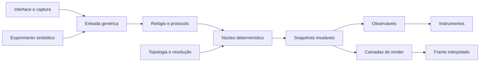

# Arquitetura estrutural

Esta arquitetura parte do código da 0.2. Ela descreve as próximas costuras do `src/`, não uma árvore final a ser criada de uma vez. Um arquivo só é separado quando passa a ter estado, ciclo de vida ou testes próprios.

## Ponto de partida

Hoje o projeto tem quatro peças centrais:

- `brain.ts` gera geometria, regiões, tipos de unidade e conexões;
- `simulation.ts` guarda o estado mutável e executa integração, atrasos e STDP;
- `inference.ts` implementa o experimento Bayesiano escalar atual;
- `main.ts` inicializa a aplicação e ainda concentra relógio, cena, renderização, HUD, captura e controles.

Essa divisão é suficiente para a 0.2. A primeira mudança não será criar um conjunto de pacotes, mas retirar do `main.ts` as duas fronteiras que já têm semântica própria: tempo e protocolo de simulação.

## Regras de dependência



As dependências seguem cinco regras:

1. O núcleo não importa Three.js, DOM, Tauri nem o conteúdo de um experimento.
2. O renderer nunca escreve no estado da simulação.
3. Observáveis leem snapshots ou acumuladores publicados; não alcançam buffers privados do núcleo.
4. Entradas pessoais são convertidas para eventos genéricos antes de cruzarem o protocolo.
5. O relógio de parede decide quantos ticks pedir, mas nunca vira argumento livre de uma equação.

## Estado e tipos

Os tipos abaixo são contratos de destino. Eles serão introduzidos conforme cada módulo surgir e não precisam ocupar um arquivo central de tipos.

```ts
type Tick = number;
type EntityId = number;
type SynapseId = number;
type FieldVertexId = number;

interface SimulationConfig {
  seed: number;
  dtSeconds: number;
  snapshotEveryTicks: number;
  model: "lif" | "conductance" | "hybrid";
}

interface ScheduledDrive {
  tick: Tick;
  sequence: number;
  target: EntityId;
  amplitude: number;
  channel: "external" | "task" | "boundary";
}

interface EngineSnapshot {
  schemaVersion: number;
  tick: Tick;
  previousTick: Tick;
  stateHash: number;
  potentials: Float32Array;
  activity: Float32Array;
  field?: FieldSnapshot;
  events: EventSnapshot;
  observables: ObservableSnapshot;
}
```

`Tick`, IDs e índices permanecem inteiros. Valores com unidades diferentes não compartilham um campo chamado apenas `value`; configurações futuras usarão nomes como `dtSeconds`, `membraneVolts` e `conductanceSiemens` quando a unidade não estiver determinada pelo tipo do bloco.

### Donos dos buffers

| Estado | Dono | Pode ser transferido? | Pode ser alterado pelo renderer? |
| :-- | :-- | :-- | :-- |
| potenciais, adaptação e refratariedade | núcleo | não diretamente | não |
| condutâncias e recursos sinápticos | núcleo | não diretamente | não |
| filas de eventos | núcleo | não | não |
| campo E/I | núcleo do campo | somente em snapshot | não |
| snapshot publicado | protocolo | sim | não |
| buffers interpolados de posição/cor | camada de render | não precisa | sim |
| histórico de instrumentos | observáveis/UI | somente sua própria cópia | não se aplica |

Snapshots usam buffers próprios. O Worker alterna dois ou três conjuntos de buffers para que nunca recicle memória ainda utilizada pelo frame atual.

## Laço de simulação

O frame deixa de chamar `simulation.step(delta)`. O relógio converte tempo real em um tick-alvo e envia esse alvo ao motor:

```ts
function onFrame(nowMs: number): void {
  const targetTick = clock.observe(nowMs, speed);
  engine.advanceTo(targetTick);

  const view = snapshots.interpolate(clock.renderTick());
  renderLayers.update(view);
  instruments.update(view.observables);
  composer.render();
}
```

No Worker, o núcleo só conhece passos inteiros:

```ts
function advanceTo(targetTick: Tick): void {
  while (state.tick < targetTick) {
    applyInputsFor(state.tick);
    decayContinuousState();
    deliverEventsInCanonicalOrder();
    integrateUnits();
    registerSpikes();
    updatePlasticity();
    publishIfDue();
    state.tick += 1;
  }
}
```

O relógio possui três políticas explícitas:

- em interação, limita o atraso acumulado e registra quando precisou descartar tempo de parede;
- em captura, nunca descarta ticks e só renderiza depois de atingir o tempo solicitado;
- em replay, ignora o relógio de parede e consome o registro de entradas até o tick final.

A velocidade da interface altera a relação entre tempo real e tick-alvo. Ela não altera `dt` nem as constantes fisiológicas.

## Determinismo

### Entradas

Toda entrada recebe `tick` e `sequence`. A ordenação é `(tick, sequence)`. Controles contínuos são amostrados e registrados como eventos; o núcleo não consulta diretamente o estado atual do DOM.

O replay guarda:

- versão do protocolo;
- configuração validada;
- semente;
- hash da topologia;
- eventos em ordem;
- versão do preset do modelo.

### Números aleatórios

O RNG será baseado em contador:

```text
random(seed, stream, entityId, tick, eventOrdinal) -> uint32
```

O endereço, e não a ordem da chamada, escolhe a amostra. Fluxos distintos separam topologia, ruído de canal, liberação sináptica e experimentos. Vetores inteiros do RNG devem ser exatos entre TypeScript e uma futura implementação Rust; transformações em ponto flutuante podem exigir tolerância entre runtimes, a menos que se adote matemática estrita própria.

### Arestas e reduções

A topologia atribui um ID estável a cada sinapse. O CSR de saída é ordenado por `(origem, destino, id)` e o índice de entrada por `(destino, origem, id)`.

Na primeira implementação, o laço quente permanece serial. Se houver paralelismo posterior:

- cada sinapse atualiza apenas seu próprio estado;
- cada alvo pertence a uma partição fixa e soma seu CSR de entrada em ordem canônica;
- métricas globais usam blocos fixos e fundem os parciais pela ordem do ID do bloco;
- estruturas como `Promise.race`, atomics de soma e iteração sobre resultados na ordem de chegada não entram no caminho determinístico.

Essa disciplina evita depender da associatividade de ponto flutuante. Igualdade bit a bit é exigida no mesmo runtime e na mesma arquitetura numérica; paridade TypeScript/Rust terá contrato explícito de exatidão ou tolerância por grandeza.

## Protocolo do Worker

O Worker entra antes do paralelismo. Seu objetivo inicial é isolar o laço fixo do frame.

Mensagens de controle:

```ts
type EngineCommand =
  | { type: "initialize"; config: SimulationConfig; topology: SerializedTopology }
  | { type: "schedule"; inputs: ScheduledDrive[] }
  | { type: "advance"; targetTick: Tick }
  | { type: "reset"; seed: number }
  | { type: "dispose" };

type EngineEvent =
  | { type: "ready"; tick: Tick }
  | { type: "snapshot"; snapshot: EngineSnapshot }
  | { type: "profile"; sample: EngineProfile }
  | { type: "fault"; code: string; tick: Tick };
```

Não haverá uma mensagem por spike. Eventos de alta frequência são compactados no snapshot em arrays de IDs, offsets temporais e amplitudes.

## Campo e patches microscópicos

O acoplamento será introduzido em três passos.

### 0.3 — campo derivado

O estado atual de spikes é agregado por região ou por vértice apenas para instrumentos e visualização. Não existe um segundo integrador.

### 0.4 — campo macroscópico

O campo E/I torna-se o estado canônico fora de patches. A topologia ganha uma malha, vizinhança e pesos de projeção. O renderer recebe a atividade composta, não buffers independentes para somar livremente.

### 0.6 — patch resolvido

Um `ResolutionMap` define:

```ts
interface ResolutionMap {
  patchId: number;
  fieldVertices: Uint32Array;
  cells: Uint32Array;
  cellToFieldWeights: Float32Array;
  boundaryWeights: Float32Array;
  blendByVertex: Float32Array;
}
```

O campo alimenta as condições de contorno do patch. A atividade agregada dos spikes substitui o campo dentro da máscara `blendByVertex`. O retorno microscópico para o campo começa desativado; quando ativado, ocorre em janelas de acoplamento e passa por testes de conservação e estabilidade.

Assim, a troca de resolução acompanha o zoom sem fazer a dinâmica depender da câmera. A câmera escolhe o que mostrar, nunca qual equação executar.

## Núcleo genérico e entrada pessoal

O motor recebe drives agendados e expõe canais de leitura. Ele não conhece letras, palavras, gramática ou o significado de uma hipótese.

```ts
interface ExperimentEncoder<Action> {
  reset(seed: number): void;
  encode(action: Action, at: Tick): ScheduledDrive[];
}

interface ExperimentDecoder<Result> {
  read(snapshot: EngineSnapshot): Result;
}
```

O experimento Bayesiano atual continua isolado em `inference.ts` até ser substituído por esse contrato. Na 0.7, uma entrada pessoal poderá morar em `experiments/symbolic-sequence.ts`: ela codifica tokens em drives genéricos e interpreta canais de saída, sem importar nem modificar internamente `simulation.ts`.

Presets guardam parâmetros; adaptadores guardam significado. Essa separação permite executar tarefas perceptivas ou simbólicas sobre o mesmo núcleo e comparar resultados sem ramificações pessoais dentro do motor.

## Observáveis

Os observáveis têm duas classes:

- **online:** baratos, atualizados em blocos durante a simulação, como taxa, corrente média e dispersão;
- **analíticos:** executados em snapshots selecionados ou offline, como homologia persistente, ajuste de avalanches e dimensionalidade em janelas longas.

Cada observável declara:

```ts
interface ObservableDefinition {
  id: string;
  unit: string;
  windowSeconds: number;
  source: "state" | "events" | "currents" | "field";
  cadenceTicks: number;
  approximation?: string;
}
```

O HUD recebe valor e metadados juntos. Um rótulo não pode reutilizar “intensidade” ou “volume” para grandezas fisicamente diferentes.

## Camadas de render

As camadas consomem a mesma visão interpolada:

```ts
interface RenderLayer {
  mount(context: RenderContext, topology: RenderTopology): void;
  update(view: InterpolatedSnapshot): void;
  setDetail(level: number): void;
  setVisible(visible: boolean): void;
  dispose(): void;
}
```

| Ordem | Camada | Fonte permitida |
| :-- | :-- | :-- |
| 1 | tecido e superfície | topologia, materiais e atividade composta |
| 2 | campo macroscópico | snapshot do campo |
| 3 | conectividade | topologia, pesos e atrasos publicados |
| 4 | unidades e microcircuito | snapshot do patch selecionado |
| 5 | eventos | spikes e chegadas sinápticas compactadas |
| 6 | seleção e orientação | estado da interface |
| 7 | instrumentos | observáveis com unidade |
| 8 | pós-processamento | exposição, bloom e preferências visuais |

Pulsos visuais representam eventos reais. Interpolação pode suavizar posição e intensidade, mas não criar spikes entre snapshots. LOD reduz geometria e amostragem visual; não altera o motor.

## Crescimento físico do `src/`

### Corte 0.3-a — relógio e contrato

```text
src/
├── main.ts
├── clock.ts
├── protocol.ts
├── simulation.ts
├── brain.ts
├── inference.ts
└── schema.ts
```

`simulation.ts` continua sendo o núcleo. `clock.ts` recebe o acumulador que hoje está em `main.ts`; `protocol.ts` contém comandos, snapshots e entradas. Esse corte já permite testar passo/frame sem mover a cena.

### Corte 0.3-b — memória e isolamento

```text
src/
├── main.ts
├── simulation.worker.ts
├── simulation.ts
├── network.ts
├── random.ts
├── observables.ts
└── ...arquivos existentes
```

`network.ts` serializa a topologia e cria CSR. `random.ts` implementa o RNG endereçado. `simulation.worker.ts` é apenas o adaptador do protocolo. `observables.ts` começa com as métricas online; não incorpora análises topológicas pesadas.

### Corte 0.3-c — renderização com donos claros

O diretório `render/` só nasce quando ao menos três camadas forem extraídas de `main.ts`:

```text
src/render/
├── brain-layer.ts
├── connection-layer.ts
├── event-layer.ts
└── render-types.ts
```

O `main.ts` permanece como composição: cria dependências, liga controles e inicia frame/Worker. Não será substituído por uma classe central que volte a possuir tudo.

### 0.4 em diante

`field.ts` aparece com o primeiro estado populacional real. Um diretório `models/` só se justifica quando LIF, campo e AdEx coexistirem. Da mesma forma, `experiments/` nasce quando houver mais de uma tarefa. A organização segue a diversidade real do código.

## Primeira sequência de implementação

1. Caracterizar o comportamento atual com testes de relógio e snapshots pequenos.
2. Extrair `clock.ts` sem alterar a equação vigente.
3. Introduzir `protocol.ts` e trocar arrays comuns de snapshot por arrays tipados.
4. Implementar o RNG endereçado e fixar seus vetores de teste.
5. Construir CSR mantendo a mesma ordem numérica e comparar o resultado com a estrutura atual.
6. Levar o laço serial ao Worker e validar replay e captura.
7. Extrair observáveis e a primeira camada de render.
8. Medir convergência antes de alterar passo, integrador ou modelo sináptico.
9. Introduzir AMPA/GABA-A atrás de um preset e comparar o modelo antigo ao novo.

Essa ordem mantém cada commit pequeno, reversível e explicável. O motor muda de estrutura antes de mudar de fisiologia, e a imagem melhora apenas quando o novo estado já pode sustentá-la.

## Comentários e documentação

Comentários de código explicam unidade, invariante, escolha numérica ou motivo não evidente. Eles não narram a edição, repetem a linha seguinte nem registram ferramentas usadas para produzir o arquivo. Decisões mais longas pertencem a estes documentos ou a um registro técnico próprio.

Arquivos gerados, licenças, atribuições e referências científicas preservam seus avisos originais. A revisão editorial remove metalinguagem do processo sem fabricar autoria ou apagar procedência.
