# Arquitetura canônica · BRAIN PRO

**Documento:** revisão 1 · 12 de agosto de 2026

**Produto observado:** 0.8.0

**Escopo:** estado atual (`as is`) e direção incremental (`to be`)

Este documento descreve o código executável. Quando houver divergência, a
precedência é: código → testes/fixtures/protocolo → manifests → auditorias com
evidência → documentação canônica → legacy. A direção futura aparece marcada
como planejada e nunca é descrita como implementada.

## Decisões vigentes

| ID | Decisão | Estado | Gatilho de revisão |
| :-- | :-- | :-- | :-- |
| ARC-001 | `brain-engine` Rust é a única fonte científica | aceita | somente evidência extraordinária de requisito impossível no núcleo atual |
| ARC-002 | `brain-wasm` é adaptador, não segundo modelo | aceita | nunca por desempenho gráfico |
| ARC-003 | Worker serial isola o laço do frame | aceita | benchmark + redução determinística + ambiente isolado |
| ARC-004 | TypeScript modular/DOM direto permanece | aceita | estado/composição/testabilidade justificarem migração mensurável |
| ARC-005 | Three.js/WebGL é o baseline | aceita | feature WebGPU com paridade, fallback e ganho medido |
| ARC-006 | Tauri reutiliza a experiência web e o crate Rust | aceita | execução nativa científica concreta exigir runner dedicado |
| ARC-007 | produto é local-first/offline-capable | aceita | colaboração, contas ou lotes remotos com requisito aprovado |
| ARC-008 | C# não é adotado | aceita | biblioteca .NET indispensável ou benchmark reproduzível de caso nativo |
| ARC-009 | snapshot é imutável para UI/renderer | aceita | não há gatilho previsto |
| ARC-010 | câmera/LOD/cor/corte nunca escolhem equação | aceita | não há gatilho previsto |
| ARC-011 | quatro hashes têm domínios independentes | aceita | mudança de schema deliberada e migração de replay |
| ARC-012 | objetos gráficos declaram proveniência | aceita | não há gatilho previsto |
| ARC-013 | fallback é diagnóstico e inerte | aceita | substituição por falha explícita, nunca por motor TS |
| ARC-014 | modelos de tarefa atravessam adaptadores explícitos | proposta | fechamento de `inference.ts` em R09-A |

## Contexto do sistema

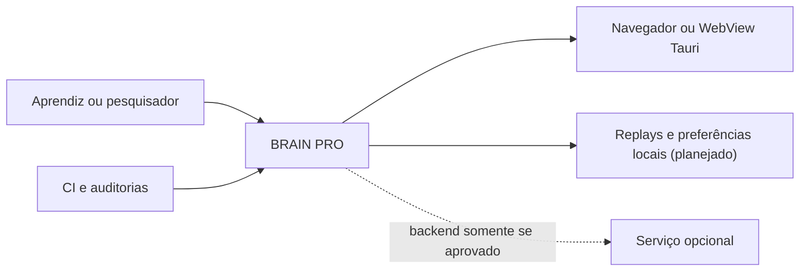
```mermaid
flowchart LR
    USER["Aprendiz ou pesquisador"] --> APP["BRAIN PRO"]
    APP --> LOCAL["Navegador ou WebView Tauri"]
    APP --> FILES["Replays e preferências locais (planejado)"]
    CI["CI e auditorias"] --> APP
    APP -. "backend somente se aprovado" .-> REMOTE["Serviço opcional"]
```

O sistema principal não depende de backend. GitHub Pages publica o mesmo shell
que Tauri hospeda. A rede não é requisito do motor.

## Containers atuais

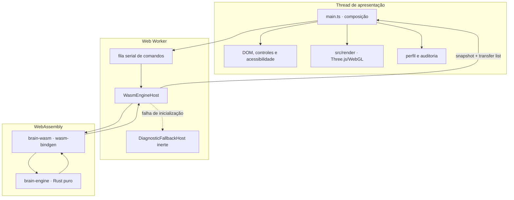
```mermaid
flowchart TB
    subgraph PRESENTATION["Thread de apresentação"]
      MAIN["main.ts · composição"]
      UI["DOM, controles e acessibilidade"]
      GFX["src/render · Three.js/WebGL"]
      PROF["perfil e auditoria"]
    end
    subgraph WORKER["Web Worker"]
      QUEUE["fila serial de comandos"]
      HOST["WasmEngineHost"]
      FALLBACK["DiagnosticFallbackHost inerte"]
    end
    subgraph WASM["WebAssembly"]
      ABI["brain-wasm · wasm-bindgen"]
      CORE["brain-engine · Rust puro"]
    end
    MAIN --> QUEUE --> HOST --> ABI --> CORE
    CORE --> ABI --> HOST -->|"snapshot + transfer list"| MAIN
    HOST -. "falha de inicialização" .-> FALLBACK
    MAIN --> UI
    MAIN --> GFX
    MAIN --> PROF
```

## Componentes atuais e propriedade

| Sistema | Módulos reais | Responsabilidade | Não pode fazer |
| :-- | :-- | :-- | :-- |
| motor científico | `crates/brain-engine/src/*.rs` | estado, equações, solvers, eventos, RNG, hashes, observáveis | DOM, Three.js, rede, filesystem, Tauri |
| fronteira Wasm | `crates/brain-wasm/src/lib.rs` | construir motor, adaptar erros, expor buffers/métodos | equações alternativas |
| host/Worker | `simulation.worker.ts`, `wasm-engine-host.ts`, `protocol.ts` | ordenar comandos, validar cotas, mover snapshots, degradação | criar atividade ou reinterpretar unidade |
| aplicação | `main.ts`, `schema.ts`, `clock.ts`, `performance-profile.ts` | bootstrap, estado de UI, cadência, controles, métricas | mutar buffers científicos |
| tarefa experimental | `inference.ts` | posterior Bayesiana escalar | permanece experimental porque alimenta `confidence` sem adaptador versionado |
| gráficos | `src/render/*` | scene graph, materiais, passes, tokens, LOD e proveniência | eventos/valores inexistentes no snapshot |
| topologia visual | `brain.ts` | geometria e conectividade procedural serializada ao motor | afirmar anatomia parcelada |
| desktop | `src-tauri` | janela, CSP, comando de metadados e opener | segundo motor |
| validação | Cargo/Vitest/scripts/fixtures | provar contratos e capturar evidência | promover por nome de teste apenas |

### Componentes do motor

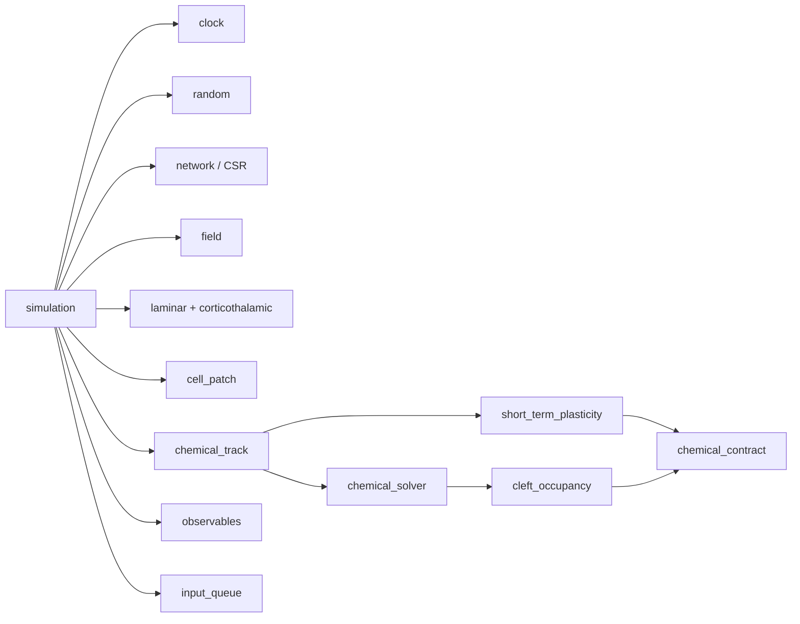
```mermaid
flowchart LR
    SIM["simulation"] --> CLOCK["clock"]
    SIM --> RNG["random"]
    SIM --> NET["network / CSR"]
    SIM --> FIELD["field"]
    SIM --> LAM["laminar + corticothalamic"]
    SIM --> CELL["cell_patch"]
    SIM --> TRACK["chemical_track"]
    TRACK --> STP["short_term_plasticity"]
    TRACK --> SOLVER["chemical_solver"]
    SOLVER --> CLEFT["cleft_occupancy"]
    STP --> CONTRACT["chemical_contract"]
    CLEFT --> CONTRACT
    SIM --> OBS["observables"]
    SIM --> INPUT["input_queue"]
```

`NeuralSimulation` compõe os subsistemas, mas cada bloco conserva estado e hash
próprios. `ChemicalTrack` é um microdomínio representativo; não é uma coleção de
todas as sinapses da rede.

## Estado, unidades e ownership

| Bloco | Dono | Publicação | Unidade/classe | Hash |
| :-- | :-- | :-- | :-- | :-- |
| rede abstrata | `NeuralSimulation` | potenciais, ativações, pesos, sinais | proxies/u.a. e metadados | `stateHash` |
| campo | `PopulationField` | E, I, `waveActivity` por vértice | u.a. | incluído no hash da rede |
| córtico-talâmico | `CorticothalamicEngine` | L1–L6 E/I e cinco escalares | adimensional | `corticothalamicHash` |
| patch | `CellPatch` | 9 arrays + escalares | V, A, Hz, s, frações | `cellPatchHash` |
| química | `ChemicalTrack` | 12 arrays + escalares | mol, mol·m⁻³, s, frações | `chemicalHash` |
| UI | `main.ts`/DOM | seleção, aba, controles, câmera | apresentação | nenhum |
| renderer | cada `RenderLayer` | matrizes, cores, geometria | apresentação | nenhum hash científico |

Estado interno científico usa `f64` por padrão. Rede, campo, coluna e patch são
quantizados para `f32` nos snapshots quando o contrato assim define; a química
v6 cruza a ABI em `Float64Array`. UI pode converter V→mV e A→pA somente na
apresentação.

Snapshots são novas views/cópias publicadas. A transfer list destaca 34
`ArrayBuffer`s ao enviá-los para a thread principal. O renderer trata todos
como somente leitura. Pooling de snapshots ainda não está implementado.

## Fronteira de execução atual

### Versões distintas

| Eixo | Valor | Política |
| :-- | :-- | :-- |
| produto | 0.8.0 | distribuição; não determina compatibilidade de wire |
| protocolo Worker | 6 | formas de comandos/eventos; atualmente usa a constante da simulação |
| ABI Wasm | 6 | métodos/buffers expostos por `brain-wasm` |
| snapshot | 6 | layout/semântica de `NeuralSnapshot` |
| engine/Tauri | 1 | metadado do crate, fora da ABI web |
| subsistemas/fixtures | 1/v1 | evolução independente por modelo/oráculo |

ABI, protocolo e snapshot valem 6 e são verificados por igualdade, mas são
conceitos diferentes. Futuras revisões devem registrar qual eixo mudou; a
igualdade numérica atual não os transforma em uma única “versão do projeto”.

### Comandos e eventos

- `initialize`: topologia procedural, seed e passo opcional;
- `schedule`: até 256 entradas, endereçadas por `(tick, sequence)`;
- `advance`: tick alvo, estímulo e plasticidade;
- `reset`: reseed opcional;
- `dispose`: libera a instância;
- eventos: `ready`, `scheduled`, `snapshot`, `fault`.

O Worker encadeia mensagens numa Promise, preservando ordem. Ainda não possui
cancelamento, timeout ou limite explícito para o número de mensagens JS
aguardando. O motor limita 4.096 entradas agendadas e 600 ticks por comando;
isso não equivale a backpressure completo. R09-B deve fechar essa lacuna antes
de aumentar o volume de eventos.

### Cotas atuais

| Recurso | Limite |
| :-- | --: |
| nós | 20.000 |
| sinapses | 250.000 |
| vértices do campo | 50.000 |
| arestas do campo | 1.000.000 |
| ticks por comando | 600 |
| entradas por mensagem | 256 |
| entradas agendadas | 4.096 |

TypeScript valida antes da construção; `brain-wasm` repete as cotas essenciais.
Cada ampliação exige benchmark e teste do primeiro valor acima do teto.

## Fluxos atuais

### Inicialização

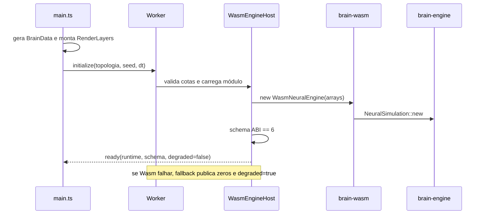
```mermaid
sequenceDiagram
    participant DOM as main.ts
    participant W as Worker
    participant H as WasmEngineHost
    participant A as brain-wasm
    participant E as brain-engine
    DOM->>DOM: gera BrainData e monta RenderLayers
    DOM->>W: initialize(topologia, seed, dt)
    W->>H: valida cotas e carrega módulo
    H->>A: new WasmNeuralEngine(arrays)
    A->>E: NeuralSimulation::new
    H->>H: schema ABI == 6
    H-->>DOM: ready(runtime, schema, degraded=false)
    Note over W,H: se Wasm falhar, fallback publica zeros e degraded=true
```

### Avanço e frame

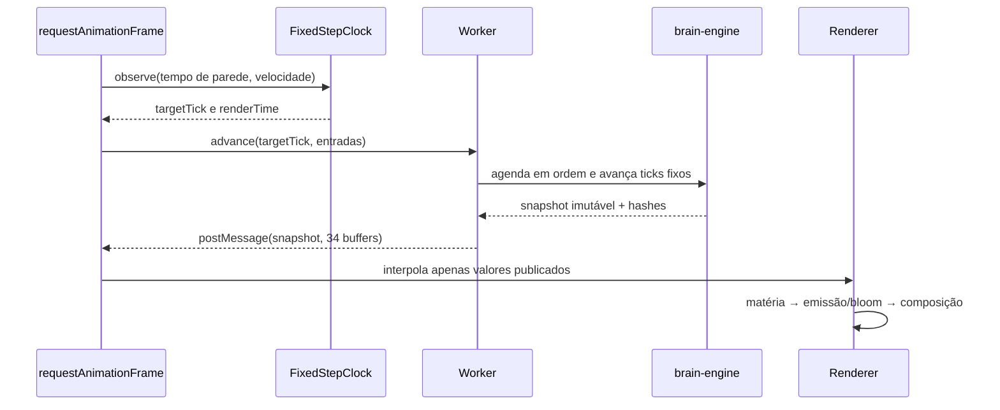
```mermaid
sequenceDiagram
    participant RAF as requestAnimationFrame
    participant C as FixedStepClock
    participant W as Worker
    participant E as brain-engine
    participant R as Renderer
    RAF->>C: observe(tempo de parede, velocidade)
    C-->>RAF: targetTick e renderTime
    RAF->>W: advance(targetTick, entradas)
    W->>E: agenda em ordem e avança ticks fixos
    E-->>W: snapshot imutável + hashes
    W-->>RAF: postMessage(snapshot, 34 buffers)
    RAF->>R: interpola apenas valores publicados
    R->>R: matéria → emissão/bloom → composição
```

O relógio de parede decide quantos ticks solicitar. `pulseSpeed` muda a relação
entre parede e alvo; não altera `SIMULATION_STEP_SECONDS`. A cadência 1/2/4/6
reduz publicações, não passos científicos.

### Persistência e replay alvo

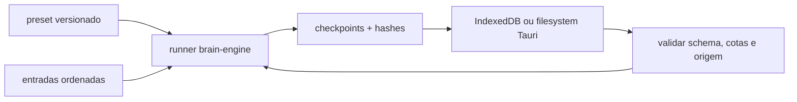
```mermaid
flowchart LR
    PRESET["preset versionado"] --> RUN["runner brain-engine"]
    LOG["entradas ordenadas"] --> RUN
    RUN --> CHECK["checkpoints + hashes"]
    CHECK --> STORE["IndexedDB ou filesystem Tauri"]
    STORE --> VALIDATE["validar schema, cotas e origem"]
    VALIDATE --> RUN
```

Persistência ainda não existe. Quando entrar, câmera e preferências terão
schema separado de presets/replays científicos.

## Arquitetura da apresentação

`main.ts` compõe quatro implementações de `RenderLayer`: cérebro, lâminas,
célula/eletricidade e sinapse. `SelectiveBloomPipeline` separa emissão do
restante e compõe o resultado. `visual-tokens.ts` centraliza identidades;
`visual-encoding.ts` transforma grandezas publicadas em cor/forma/direção.

Proveniência atual é declarada por objeto como domínio visual (`matter` ou
`emission`) e origem (`state`, `topology`, `decoration`). Todo efeito de estado
deve apontar para snapshot, embora esse apontamento ainda não seja um campo
estruturado por objeto; GRAPHICS-010 torna o vínculo obrigatório.

## Introdução de uma nova grandeza

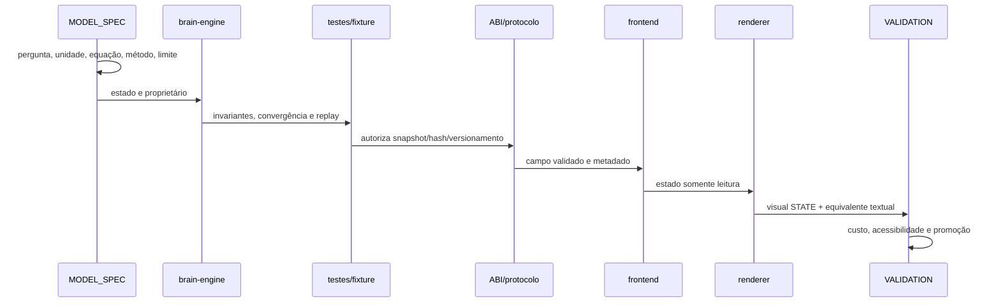
```mermaid
sequenceDiagram
    participant M as MODEL_SPEC
    participant E as brain-engine
    participant T as testes/fixture
    participant A as ABI/protocolo
    participant U as frontend
    participant G as renderer
    participant Q as VALIDATION
    M->>M: pergunta, unidade, equação, método, limite
    M->>E: estado e proprietário
    E->>T: invariantes, convergência e replay
    T->>A: autoriza snapshot/hash/versionamento
    A->>U: campo validado e metadado
    U->>G: estado somente leitura
    G->>Q: visual STATE + equivalente textual
    Q->>Q: custo, acessibilidade e promoção
```

Renderer não pode antecipar essa sequência, exceto decoração inerte claramente
rotulada.

## Arquitetura-alvo incremental

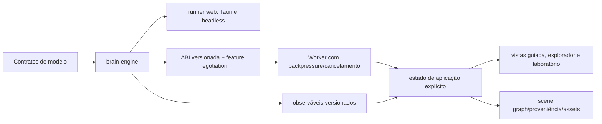
```mermaid
flowchart LR
    MODEL["Contratos de modelo"] --> CORE["brain-engine"]
    CORE --> RUNNERS["runner web, Tauri e headless"]
    CORE --> ABI["ABI versionada + feature negotiation"]
    ABI --> WORKER["Worker com backpressure/cancelamento"]
    WORKER --> APP["estado de aplicação explícito"]
    APP --> VIEWS["vistas guiada, explorador e laboratório"]
    APP --> GRAPH["scene graph/proveniência/assets"]
    CORE --> OBS["observáveis versionados"]
    OBS --> APP
```

Mudanças alvo:

- separar estado de aplicação do bootstrap monolítico sem escolher framework por
  preferência;
- introduzir adaptadores de experimento e remover a posterior implícita do
  comando genérico;
- adicionar backpressure, cancelamento e diagnóstico de fila;
- gerar/testar metadados de ABI e unidades a partir de contrato único;
- oferecer runner Rust headless/Tauri sem duplicar o motor;
- registrar assets, transformações e proveniência gráfica;
- persistir replays e preferências em schemas separados.

## Avaliação de tecnologias

| Alternativa | Requisito resolvido | Web/Pages | Duplicação/risco numérico | Cópias/latência | Operação/manutenção | Decisão |
| :-- | :-- | :-- | :-- | :-- | :-- | :-- |
| Rust/Wasm atual | simulação interativa local | plena | uma fonte | fronteira já medida | menor custo cognitivo | manter |
| Rust nativo no Tauri | lotes/arquivos/CPU nativa | desktop | reutiliza crate | sem Wasm; IPC a projetar | natural ao workspace | preferir quando necessário |
| backend Rust | lotes remotos | web depende de rede | reutiliza crate | rede/serialização | autenticação, filas e custo | adiar até requisito |
| C# serviço local | biblioteca .NET indispensável | não no Pages | risco se reimplementar | processo/IPC | segundo runtime/distribuição | não adotar agora |
| C# backend remoto | integração institucional | opcional | alto se duplicar | rede | maior superfície/CI | não adotar agora |
| C# desktop | novo shell | não | risco alto | interop | descarta Tauri/TS | rejeitado sem caso concreto |
| Wasm threads/SAB | throughput paralelo | exige COOP/COEP | redução determinística difícil | reduz tempo, aumenta complexidade | fallback serial obrigatório | pesquisar após benchmark |
| WebGPU/WGSL | partículas, volume, kernels paralelos | suporte variável | referência CPU obrigatória | reduz CPU/cópias em casos | dois backends | gráficos futuros, ciência só com paridade |
| TypeScript + DOM | UI atual | plena | não integra ciência | custo aceitável | já dominado | manter |
| framework UI | composição futura complexa | plena | neutro | bundle/migração | reescrita relevante | somente após métrica de complexidade |

## Pipeline gráfico alvo

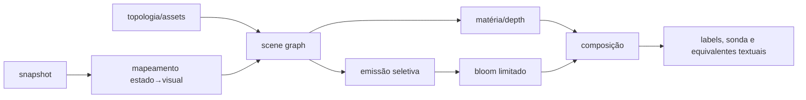
```mermaid
flowchart LR
    SNAP["snapshot"] --> MAP["mapeamento estado→visual"]
    TOPO["topologia/assets"] --> SCENE["scene graph"]
    MAP --> SCENE
    SCENE --> MAT["matéria/depth"]
    SCENE --> EMI["emissão seletiva"]
    MAT --> COMP["composição"]
    EMI --> BLOOM["bloom limitado"] --> COMP
    COMP --> HUD["labels, sonda e equivalentes textuais"]
```

WebGL permanece baseline. WebGPU pode acelerar partículas/volume/culling com
fallback e paridade visual; não muda `dt` nem move ciência para shader sem
referência CPU e testes.

## Implantação

### Web

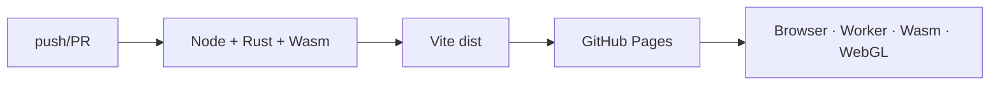
```mermaid
flowchart LR
    GIT["push/PR"] --> CI["Node + Rust + Wasm"]
    CI --> DIST["Vite dist"]
    DIST --> PAGES["GitHub Pages"]
    PAGES --> BROWSER["Browser · Worker · Wasm · WebGL"]
```

### Tauri

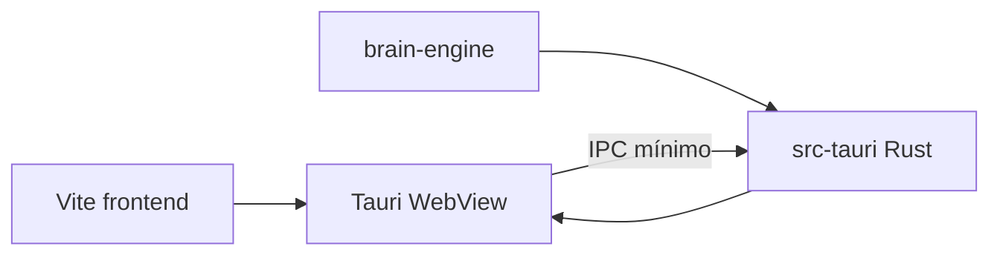
```mermaid
flowchart LR
    WEB["Vite frontend"] --> WEBVIEW["Tauri WebView"]
    HOST["src-tauri Rust"] --> WEBVIEW
    CORE["brain-engine"] --> HOST
    WEBVIEW -->|"IPC mínimo"| HOST
```

Hoje Tauri expõe apenas `neural_runtime_info` e `opener:default`. A execução
científica nativa completa é alvo, não estado atual.

### Backend opcional

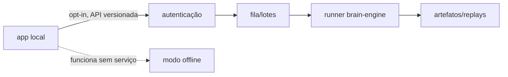
```mermaid
flowchart LR
    LOCAL["app local"] -->|"opt-in, API versionada"| AUTH["autenticação"]
    AUTH --> QUEUE["fila/lotes"]
    QUEUE --> RUST["runner brain-engine"]
    RUST --> STORE["artefatos/replays"]
    LOCAL -. "funciona sem serviço" .-> OFFLINE["modo offline"]
```

Essa caixa só entra para colaboração, armazenamento, catálogo, telemetria
consentida ou lotes longos. Não será criada para “escalar” a aplicação local.

## Concorrência, memória e desempenho

- laço científico serial e determinístico;
- Worker evita bloquear apresentação, mas não é paralelismo do solver;
- reduções futuras usam partições fixas e fusão por ID;
- snapshots usam typed arrays transferidos; pooling/SharedArrayBuffer é futuro;
- frame interpola snapshots e pode degradar LOD, sombras, volumetria, partículas
  e cadência;
- nenhuma degradação altera equações, passo ou preset silenciosamente;
- métricas mínimas: tick p50/p95/p99, alocações, bytes/snapshot, fila, latência,
  frame CPU/GPU, draw calls, memória e custo por camada.

## Segurança, privacidade e supply chain

- CSP Tauri restringe origens; IPC permanece mínimo;
- inputs e topologias têm cotas em TS e Rust/Wasm;
- importações futuras validam schema, tamanho, IDs, strings e caminhos;
- labels/metadados nunca entram como HTML não sanitizado;
- sem código remoto, secrets no cliente ou telemetria implícita;
- dependências e Actions devem ser auditadas/pinadas; SBOM e licença entram no
  gate de release;
- dados pessoais só entram após modelo de ameaça, consentimento, retenção,
  exportação e exclusão.

## Observabilidade e falhas

`RuntimeProfiler` observa latência, frame, GPU, heap e bytes. `diagnostics`
publica runtime, degradação e quatro hashes. O fallback avança o tick e publica
zeros apenas para manter o shell inspecionável; a UI deve indicar claramente que
nenhuma equação científica está rodando.

Faltam: tamanho da fila de mensagens, cancelamento, timeout, código de fault por
categoria, perda de contexto WebGL e descarte/reciclagem auditável de buffers.

## Contradições resolvidas

| ID | Fontes em conflito | Evidência mais forte | Decisão/ação |
| :-- | :-- | :-- | :-- |
| C-01 | headers 0.7 × manifests/código 0.8 | manifests + ABI/código | docs declaram produto 0.8.0 promovido em R08-P4 |
| C-02 | roadmap 0.7 × proposta 0.8 × código concluído | código/testes | um roadmap canônico; ambos arquivados |
| C-03 | “0.8 fechada” × gates de promoção incompletos | auditorias P2/P3/P4 | promoção ocorreu somente após os quatro gates |
| C-04 | 22 buffers/ABI v5 × ABI v6 atual | protocolo/transfer list | estado atual é 34; 22 permanece só como história |
| C-05 | `main.ts` concentrava render × `src/render` existente | árvore atual | descrição atualizada; `main.ts` ainda concentra composição/UI |
| C-06 | “gate de invertibilidade pixel” × teste analítico | script/testes | R08-P3 amostra render target e pixels conhecidos em dois backends |
| C-07 | “modo sem cor comprova redundância” × filtro grayscale | código auditável | R08-P3 exige bindings e pistas geométricas concretas além da captura |
| C-08 | TS só apresenta × posterior alimenta drive | `main.ts`/`inference.ts` | experimento permanece explícito e R09-A resolve ownership |
| C-09 | Tauri roda núcleo nativo × host atual só informa schema | `src-tauri/src/lib.rs` | execução nativa é alvo, não capacidade atual |
| C-10 | VISUAL_SPEC ativo × GRAPHICS_SPEC requerido | conjunto canônico | conteúdo incorporado e proposta arquivada |

## Achados da auditoria 0.8 reavaliados

| Achado | Veredito atual | Evidência/pendência |
| :-- | :-- | :-- |
| P1 plano 0.8 | FECHADO, substituído | proposta teve cortes; agora ROADMAP canônico |
| P2 programa visual ausente | FECHADO documentalmente | GRAPHICS_SPEC/roadmap; futuras features ainda planejadas |
| P3 arquitetura desatualizada | FECHADO por esta revisão | este documento |
| P4 `src/render`/interface | FECHADO | diretório, `RenderLayer` e testes existem |
| P5 inferência fora do contrato | ACEITO PARA R09-A | `posterior` ainda alimenta `confidence`; primeiro corte da 0.9 |
| E1 perfil sem ambiente | FECHADO em R08-P2 | artefato schema 2 registra host, navegador, preset e contagens |
| E2 hardware real | FECHADO em R08-P3 | Intel UHD 770/ANGLE D3D11 versionada com ambiente e custos |
| E3 redundância sem cor | FECHADO em R08-P3 | 72 bindings + testes das geometrias/posições/orientações concretas |
| E4 estado→pixel | FECHADO em R08-P3 | alvo WebGL, readback sRGB→linear e erro abaixo de `0,012` em dois backends |
| R1 tokens dispersos | FECHADO | `visual-tokens.ts` |
| R2 bloom global/aditivo | FECHADO | `SelectiveBloomPipeline` + contrato de materiais |
| R3 corrente sem sinal | FECHADO | `signedMean`, direção e testes |
| R4 fronteira ilegível | ACEITO PARA R09-C | legenda textual existe; a Prancha Elétrica substituirá o toro agregado |
| R5 Célula/Eletricidade duplicadas | ACEITO PARA R09-C | compartilham `CellRenderLayer`; R09-C cria prancha própria |
| R6 alocações por frame | ACEITO PARA R09-C | dívida baixa medida no baseline físico; otimização acompanha a nova camada |
| R7 limpeza/visibilidade por frame | ACEITO PARA R09-C | custo medido; reciclagem acompanha a nova camada |
| M1 tempo por spike | ACEITO PARA R09-B | só flag por tick/primeiro spike; eventos são pré-requisito da 0.9 |
| M2 dendrito único | ACEITO PARA R09-E | contrato atual é um compartimento; multicompartimentos pertencem à 0.9 |
| M3 química inexistente | FECHADO no microdomínio local | química v6 existe; transmissão de volume continua futura |

## Dependência entre fases

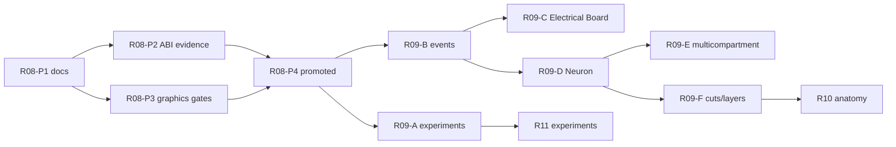
```mermaid
flowchart LR
    P1["R08-P1 docs"] --> P2["R08-P2 ABI evidence"]
    P1 --> P3["R08-P3 graphics gates"]
    P2 --> P4["R08-P4 promoted"]
    P3 --> P4
    P4 --> A["R09-A experiments"]
    P4 --> B["R09-B events"]
    B --> C["R09-C Electrical Board"]
    B --> D["R09-D Neuron"]
    D --> E["R09-E multicompartment"]
    D --> F["R09-F cuts/layers"]
    F --> ATLAS["R10 anatomy"]
    A --> EXP["R11 experiments"]
```

As regras executáveis do motor estão em [ENGINE_SPEC.md](ENGINE_SPEC.md), a
semântica matemática em [MODEL_SPEC.md](MODEL_SPEC.md), a aplicação em
[FRONTEND_SPEC.md](FRONTEND_SPEC.md), os gráficos em
[GRAPHICS_SPEC.md](GRAPHICS_SPEC.md) e os gates em [VALIDATION.md](VALIDATION.md).
