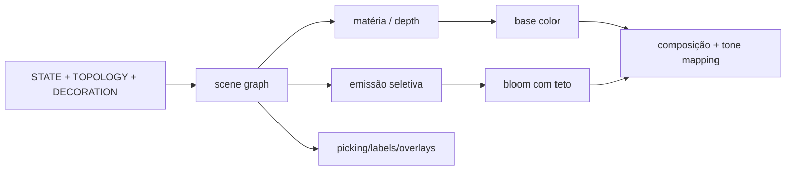

# Especificação gráfica e de proveniência · BRAIN PRO

**Revisão:** 8 · R10-B validado em Three.js 0.185/WebGL · produto 0.9.0

Este documento incorpora e substitui o antigo contrato visual da proposta 0.8,
preservado em [`docs/legacy/specs`](docs/legacy/specs/VISUAL-SPEC-v0.8-proposal.md).
Ele regula scene graph, materiais, animações, assets, camadas, cortes e prova de
fidelidade entre estado calculado e estado mostrado.

## Requisitos normativos

| ID | Requisito |
| :-- | :-- |
| GFX-001 | câmera, LOD, clipping, cor e qualidade não alteram motor ou hashes. |
| GFX-002 | objeto visível declara `STATE`, `TOPOLOGY` ou `DECORATION`. |
| GFX-003 | `STATE` aponta para campo/unidade/transformação publicados. |
| GFX-004 | `TOPOLOGY` declara origem, escala, transformação e limite. |
| GFX-005 | `DECORATION` nunca pulsa ou muda por estado científico. |
| GFX-006 | matéria e emissão usam pipelines distinguíveis; bloom só amplia emissão. |
| GFX-007 | cor não é a única codificação. |
| GFX-008 | animação discreta nasce de evento publicado. |
| GFX-009 | movimento reduzido mantém equivalente estático. |
| GFX-010 | vínculo estado→objeto é estruturado e auditável, não comentário informal. |
| GFX-050 | a vista Neurônio possui scene graph próprio, geometria determinística e evento visual autorizado exclusivamente pelo lote carimbado. |
| GFX-069 | materialidade realista-ilustrativa troca materiais, nunca geometria semântica, IDs, bindings ou eventos. |
| GFX-070 | somente objetos `matter` elegíveis recebem PBR; emissão, linhas, pontos, labels e overlays mantêm codificação auditada. |
| GFX-071 | cada vista possui manifesto de perfil, licença/fonte, escala, UV/normal/tangente, espaço de cor, luz, custo e fallback. |
| GFX-072 | aparência realista permanece `DECORATION` ou `TOPOLOGY` conforme a proveniência e nunca eleva classe epistemológica. |
| GFX-073 | perfil realista preserva contraste, monocromia, movimento reduzido, picking, equivalente textual e cinco hashes. |
| GFX-074 | falha parcial de asset/shader não mistura perfis: a vista retorna atomicamente ao esquemático. |
| GFX-075 | fabricação por vista exige captura comparativa, orçamento GPU e auditoria `materialProfileAudit()` sem lacunas. |
| AST-001 | anatomia detalhada não implica validação biológica. |
| AST-002 | estrutura entra por função, orientação decorativa ou proveniência topológica declarada. |
| AST-010 | morfologia procedural declara seed, stream, hash e limite ilustrativo; não afirma tipo celular real. |
| AST-030 | estrutura catalogada possui ID semântico estável, pai válido, nome, sinônimos, lado, escala e vistas aplicáveis. |
| AST-031 | toda entrada resolve fonte, licença e versão; asset externo exige manifesto e SHA-256 antes de ser aceito. |
| AST-032 | toda entrada resolve sistema de coordenadas, unidade, escala, orientação e transformação, sem converter unidade procedural em calibração. |
| AST-033 | nível de evidência, afirmação permitida e ao menos uma limitação são explícitos e não são elevados pela aparência. |
| AST-034 | cada objeto renderizável aponta diretamente para uma entrada do catálogo ou declara por que não representa anatomia. |
| AST-036 | nomenclatura/conectividade de referência não elevam geometria ilustrativa; o nível declarado é o mais fraco e a diferença aparece em afirmações/limitações. |
| VAS-001 | fluxo/perfusão/oxigenação só animam com estado/modelo correspondente. |
| VAS-002 | todo segmento resolve classe, ordem, lado, vistas e entrada do catálogo. |
| VAS-003 | o grafo rejeita órfãos/IDs desconhecidos, valida anastomose e permite apenas transições arterial→capilar→venoso. |
| VAS-004 | direção é geometria estática e rótulo, nunca animação descrita como fluxo. |
| VAS-005 | classes vasculares são distinguíveis por forma, espessura, padrão e rótulo além da cor. |
| VAS-006 | modo esqueleto isola vasos com contexto residual e preserva hashes. |
| VAS-007 | toda vista declara teto de draws, triângulos e memória; excesso degrada LOD. |
| VAS-008 | nenhuma entrada vascular é `STATE`; promoção futura exige campo, unidade, solver e validação. |
| ELE-001 | Prancha Elétrica mostra grandezas com unidade e origem operacional. |
| ELE-002 | Prancha Elétrica possui scene graph próprio e não reutiliza a cena Célula. |
| ELE-003 | corrente preserva sinal e direção com orientação, tamanho, posição e rótulo redundantes. |
| ELE-004 | condutância efetiva só é derivada de corrente, potencial dendrítico e reversão declarados. |
| ELE-005 | nível agregado/celular/eventos muda apenas detalhe visual e observáveis. |
| ELE-006 | custo máximo é 11 draws e marcadores só atualizam quando muda o hash de eventos. |
| GFX-040 | prancha separa STATE, TOPOLOGY e DECORATION e mantém fallback textual. |
| PERF-010 | todo shader/pass/asset tem orçamento e fallback. |

## Proveniência por objeto

Cada objeto/lote registra:

| Campo | Conteúdo |
| :-- | :-- |
| `id`/nome | identidade semântica estável e rótulo humano |
| escala | encéfalo, região, coluna, patch, neurônio, sinapse, receptor |
| classe | `STATE`, `TOPOLOGY` ou `DECORATION` |
| fonte | snapshot/símbolo, gerador/preset ou asset/atlas |
| unidade | obrigatória para `STATE` quantitativo |
| campo | caminho canônico no snapshot/observável |
| transformação | normalização, interpolação, clamp autorizado e escala visual |
| material/passe | matéria/emissão/overlay e parâmetros relevantes |
| animação | primitiva permitida e condição de autorização |
| LOD | níveis e informação preservada |
| interação | picking, teclado, foco e equivalente textual |
| teste | estrutural, visual e de independência do hash |
| licença/versão/hash | obrigatório para assets externos |
| evidência | ilustrativo, procedural, topológico, atlas, calculado ou calibrado |

O código atual declara domínio (`matter`/`emission`) e origem
(`state`/`topology`/`decoration`). GFX-010 estende essa marcação com campo,
unidade e transformação. O contador atual prova que há declaração; ainda não
prova que o campo declarado pintou o pixel correto.

## Estado gráfico atual

| Layer | Objetos principais | Fonte | Limite conhecido |
| :-- | :-- | :-- | :-- |
| `BrainRenderLayers` | pontos, cascas convexas, conexões e pulsos | rede/campo/topologia procedural | aloca array interpolado e limpa 900 instâncias por frame |
| `LaminarRenderLayer` | L1–L6 E/I, vias, relé e TRN | snapshot corticotalâmico | coluna didática, não anatomia |
| `CellRenderLayer` | 12 somas, dendritos, halos e contorno | patch | vista Célula; soma/proximal/distal publicados |
| `ElectricalBoardLayer` | 12 nós, barras V, anéis S, vias e eventos | patch + topologia macro rotulada | esquema próprio; 6/10/11 draws conforme detalhe |
| `SynapseRenderLayer` | membranas, vesículas, nuvens, receptores e recaptura | química v6 | microdomínio representativo; escalas exageradas |

`visual-tokens.ts` centraliza identidades. `visual-encoding.ts` conserva sinal
de corrente e usa plano do toro como pista redundante. `SelectiveBloomPipeline`
separa objetos de emissão, renderiza o bloom e compõe com a cena base.

## Pipeline

### Matéria

- `NormalBlending`, profundidade e ordenação coerentes;
- anatomia, membrana, células, vias e objetos que ocupam espaço;
- transparência declara ordem e limita overdraw;
- PBR/transmission/SSS aproximado só após orçamento e fallback.

### Emissão

- aditivo apenas para atividade/corrente/evento que realmente emite;
- testa contra profundidade da matéria;
- bloom seletivo, intensidade limitada e medição de saturação;
- não branqueia matiz/intensidade até perder invertibilidade.

### Composição e overlays

- tone mapping/exposição fazem parte do contrato de rampa;
- antialiasing e resolução podem degradar sem mudar ciência;
- HUD/labels/probes ficam semanticamente no DOM quando possível;
- clipping/stencil usa pass próprio e possui limpeza/dispose explícitos.

Shaders futuros declaram custo de compilação, textura/render target, precisão,
backend e versão fallback. WebGPU não é requisito da baseline.

## Materiais e realismo

| Recurso | Uso permitido | Condição |
| :-- | :-- | :-- |
| PBR/roughness/normal | matéria orientativa | asset/procedural com escala e custo |
| transmissão/translucidez | películas/membranas | ordenação e contraste preservados |
| SSS aproximado | tecido ilustrativo | rotulado e com fallback |
| mielina/vascular | identidade topológica | fonte/licença/limite |
| volumetria/raymarch | campo calculado | buffer real, passo visual, orçamento e WebGL fallback |
| sombras/oclusão | profundidade | não ocultar estado nem quebrar acessibilidade |

Uma malha mais detalhada continua `DECORATION` até haver proveniência. Material
“médico” não transforma o projeto em visualização clínica.

### Película de materialidade por vista

A película é um perfil substituível sobre o scene graph existente, não uma
textura única aplicada cegamente ao canvas. `schematic` é o fallback e
`realistic-illustrative` substitui somente materiais de `matter` incluídos no
manifesto executável, com normal, proveniência e envelope local declarados.
Emissão, linhas, pontos, labels e overlays permanecem no passe auditado para que
o acabamento não esconda causalidade visual.

`RealisticIllustrativeMaterialManager` mantém o material esquemático original,
aloca um `MeshPhysicalMaterial` por objeto elegível e troca apenas a referência
`object.material`. UUID da geometria, nome, `userData`, binding e evento não são
tocados. Tecido usa rugosidade 0,52/transmissão 0,10/sheen 0,25; membrana usa
rugosidade 0,32/transmissão 0,22/sheen 0,18; substrato usa rugosidade 0,72,
transmissão e sheen zero. Três normal maps determinísticos de 256² (`cortical`,
`membrane` e `vesicle`) são fabricados em canvas e compartilhados. Um
`RoomEnvironment` procedural convertido por PMREM fornece reflexão/refração,
sem atlas, download ou textura externa. Três luzes `DECORATION` completam a
iluminação ilustrativa.

Materiais transparentes `DoubleSide` podem exigir o segundo draw documentado
pelo Three.js, e a transmissão pode exigir um passe de refração. A auditoria
mede o delta real por vista; o manager também reporta estimativas separadas de
dupla face e transmissão. Geometria, bindings e hashes continuam invariantes.

Falha de criação, compilação de shader, perda de contexto ou alto contraste restaura todos os
materiais esquemáticos atomicamente. `dispose()` restaura o perfil, descarta os
PBR próprios, os três normal maps, o PMREM e remove a iluminação. O perfil não
possui geometria própria.

| Vista | Base preservada | Materialidade permitida em R09-F | Alegação proibida |
| :-- | :-- | :-- | :-- |
| Visão Geral | rede, campo, pulsos e superfície procedural | casca/tecido ilustrativos com escala e custo | atlas, anatomia clínica ou atividade em estrutura sem estado |
| Lâminas | L1–L6, vias, relé e TRN didáticos | volume e rugosidade que preservem formas redundantes | espessura anatômica calibrada |
| Célula | 12 somas, dendritos proximal/distal, correntes e seleção | membrana/superfície ilustrativa por lote | canais dendríticos ativos não publicados |
| Neurônio | geometria determinística por `seed + cellId` | soma, gradiente proximal/distal e axônio ilustrativo sem mudar o hash geométrico | tipo celular, mielinização funcional ou propagação ativa |
| Eletricidade | nós, setas, V/A/S, eventos e tabela | substrato de prancha e relevo orientativo | circuito físico equivalente ao tecido biológico |
| Sinapse | membranas, vesículas, fenda, receptores e recaptura | transmissão/SSS ilustrativos com escala exagerada rotulada | ultraestrutura medida ou concentração volumétrica ausente |

Cada vista registra: lista de objetos elegíveis e
protegidos; origem/licença/hash dos assets; unidades e transformação; UV,
normais, tangentes e espaço de cor; iluminação/tone mapping; orçamento de draws,
texturas e memória; fallback esquemático; capturas colorida, monocromática,
movimento reduzido e viewport móvel. O inventário executável reporta
`contractReady`, objetos limitados e materiais físicos ativos por vista.

## Pilha anatômica progressiva

### Catálogo anatômico schema 1

R10-A cataloga somente a anatomia/topologia já presente; não importa atlas nem
altera os seis scene graphs. `src/anatomy/catalog-v1.json` contém 32 entradas,
cinco fontes internas e cinco transformações. O fingerprint FNV-1a de 64 bits
audita a serialização canônica do catálogo, mas é metadado de apresentação e
não constitui um sexto hash científico.

IDs usam o namespace `brain-pro:anatomy/`. A árvore possui uma raiz, pais sem
ciclo e busca determinística acento-insensível em ID, nome e sinônimos. As
classes `PROCEDURAL`, `ILLUSTRATIVE`, `DIDACTIC`, `FENOMENOLOGICAL` e
`MODEL_BOUND` descrevem a força da evidência de cada item; nenhuma entrada é
`CALIBRATED`. Fonte e transformação são referências fechadas no mesmo schema.

`declareAnatomicalBinding()` marca estruturas; `declareNonAnatomical()` obriga
overlays, estados e indicadores a explicar sua exclusão. A auditoria cobre 98
objetos renderizáveis nas seis vistas: 58 ligados ao catálogo e 40 excluídos
explicitamente, sem lacuna ou ID desconhecido. `pickAnatomicalEntry()` ignora
overlays e entrega o mesmo ID usado pela árvore acessível. O catálogo não cria
material, geometria, textura, render target ou draw call.

Importações futuras passam pelo parser estrito com limite de 256 KiB, rejeição
de campos desconhecidos, unicidade, integridade referencial e SHA-256 obrigatório
para fontes externas. R10-A inclui zero asset externo; sua licença interna não
autoriza incorporar um atlas de terceiros.

| Camada | Por que existe | Classe antes/depois da fonte | Entrada | Interação/limite |
| :-- | :-- | :-- | :-- | :-- |
| escalpo/crânio | orientação | DECORATION → TOPOLOGY | pós-baseline | desligados por padrão; sem afirmação clínica |
| meninges/pia | ensinar relações de cobertura | DECORATION → TOPOLOGY | com tarefa educacional | transparência/recorte; escala declarada |
| córtex/superfície | suporte da leitura macro | procedural DECORATION; atlas TOPOLOGY | 0.9/1.0 | casca atual não é variedade anatômica |
| L1–L6 | ligar coluna ao patch | STATE no esquema; anatomia futura | já há coluna didática | espessura não calibrada |
| substância branca/feixes | orientação causal | TOPOLOGY | com fonte/IDs | não chamar de tractografia detalhada |
| tálamo/TRN | circuito existente | STATE/TOPOLOGY | existente na coluna | agregados fenomenológicos |
| hipotálamo/amígdala/hipocampo/basal | função futura | DECORATION proibida como atividade | quando circuito/tarefa existir | não animar sem estado |
| cerebelo/tronco | orientação procedural | TOPOLOGY procedural | existente na visão geral | fora do campo cortical atual |
| ventrículos | orientação | DECORATION/TOPOLOGY | opcional | sem fluxo de LCR sem modelo |
| vascular | orientação/fluxo futuro | TOPOLOGY; STATE somente com hemodinâmica | 0.10+ | ver VAS-001 |
| patch/neurônio/sinapse | escalas científicas | STATE + TOPOLOGY | compartimentos passivos publicados; morfologia fina continua ilustrativa | selo de resolução obrigatório |

Cada camada define opacidade, raio-X, recorte, material, LOD, custo, picking,
fonte e nível de evidência. Estruturas sem função podem existir apenas como
orientação decorativa inequívoca.

## Isolamento e navegação anatômica

Usuário deve poder:

- esconder tudo, mostrar uma camada, isolar estrutura e manter contexto residual;
- alternar raio-X, opacidade, borda e clipping;
- percorrer hierarquia, restaurar conjunto e salvar preset visual;
- mostrar matéria sem emissão, emissão sem matéria e camada química selecionada;
- isolar arterial/venoso/capilar, tálamo, hipotálamo, amígdala, hipocampo,
  área cortical ou conexões escolhidas quando existirem no catálogo.

Isolamento é estado de apresentação. O hash científico antes/depois deve ser
idêntico. Preset visual é versionado separadamente de preset científico.

Busca futura inclui nome, sinônimos, árvore, breadcrumbs, esquerda/direita,
cubo de orientação, miniatura, câmera, labels com collision avoidance e painel
de fonte/evidência. Toda busca gráfica tem equivalente acessível no DOM.

## Sistema vascular

R10-B implementa o primeiro corte topológico/ilustrativo:

- hierarquia arterial, venosa e capilar com IDs semânticos;
- direção topológica, espessura, LOD, seleção, isolamento e transparência;
- relação com estruturas, licença, escala, transformação e orçamento;
- modo “esqueleto vascular”, probe e legenda;
- padrões/forma distinguem arterial e venoso sem depender só de cor.

Fluxo, pulso, perfusão e oxigenação ficam proibidos até existir estado com
unidade, origem, solver, validação e campo publicado. Um relógio visual não é
modelo hemodinâmico.

O contrato `brain-pro-vascular` schema 1 contém 42 segmentos direcionados: 21
arteriais, dois capilares e 19 venosos. A auditoria exige simetria das relações,
alcance artéria→capilar→sumidouro venoso, exatamente um ciclo conectado para a
anastomose declarada e referências válidas ao catálogo 1.1.0. O catálogo contém
44 entradas vasculares, todas `ILLUSTRATIVE`, e permanece árvore de contenção.

A geometria é procedural e construída uma vez. Os seis subgrupos somam 12 draw
calls (teto 17): Visão Geral 3, Lâminas 2, Célula 2, Neurônio 1, Eletricidade 0 e
Sinapse 4. Todo objeto vascular é `matter`, `TOPOLOGY`, ligado diretamente ao
catálogo, incluído em clipping e excluído de bloom; nenhum objeto é animado. O
manifesto PBR incremental contém 12 objetos e não altera o baseline histórico de
25 objetos do R09-F. Artéria usa perfil circular/tapered e chevrons; veia usa
perfil achatado/duplo; capilar usa filamento/pontilhado. O modo esqueleto apenas
reduz a matéria não vascular e restaura os materiais exatamente após o frame.

## Planos de corte

Quatro orientações: coronal, sagital, axial e oblíqua, além de laje entre dois
planos, são implementadas por `ClippingSystem` e `StencilCapPass`.

- clipping local por camada opt-in;
- tampa por stencil para evitar casca visualmente oca;
- espessura/laje, reset e câmera predefinida;
- sonda da face lê grandeza publicada, unidade e interpolação declarada;
- teclado/touch alteram posição/orientação com feedback numérico;
- qualquer operação mantém hashes do motor.

O plano simples usa um `THREE.Plane`; a laje usa duas meias-regiões opostas com
`clipIntersection = false`, preservando apenas o intervalo. Cada `RenderLayer`
faz opt-in e cada objeto pode declarar exclusão. Para as malhas fechadas do
manifesto de tampa, duas cópias rasas compartilham a geometria original e
incrementam/decrementam o stencil em `BackSide`/`FrontSide`; um plano
`DECORATION` desenha apenas onde o stencil é diferente de zero e o limpa após o
pass. Os render targets de composição possuem depth e stencil explícitos.

O teto é 18 draws adicionais: 9 no corte encefálico simples (quatro cascas ×
dois lados + tampa) e 18 na laje. Geometria de origem nunca é descartada pelo
pass; materiais stencil, geometrias das tampas e render targets têm owner e
`dispose()` explícitos. O rollback desliga o clipping e conserva isolamento e
opacidade.

Uma face pode mostrar campo, atividade laminar ou concentração somente quando a
transformação posição→domínio é válida. Não se amostra química de sinapse local
num corte encefálico como se fosse campo volumétrico. Em R09-F, a única sonda
habilitada está na Visão Geral: média dos vértices de `field.waveActivity` em uma
faixa ±0,08 unidade procedural da face, interpolada linearmente entre snapshots
publicados e rotulada como `normalized field activity`. Nas cinco vistas sem
mapeamento macroscópico posição→campo ela responde explicitamente indisponível.

## Escada de escalas e vista Neurônio

| Escala | Extensão orientativa | Estado autoritativo | Estado da vista |
| :-- | :-- | :-- | :-- |
| encéfalo | dezenas de cm | rede + campo | implementada |
| região | cm | campo por vértice | incorporada à Visão Geral |
| coluna | mm | L1–L6 + relé/TRN | implementada |
| patch | centenas de µm | 12 células | implementada |
| neurônio | dezenas de µm | uma célula/compartimentos | implementada em R09-D |
| sinapse | µm | microdomínio químico | implementada com escala exagerada rotulada |

### Seleção

Clique/raycast e lista/teclado escolhem o mesmo ID. `Tab` percorre, `Enter`
amplia e `Escape` retorna. Seleção/câmera não cruzam o protocolo científico.

### Morfologia honesta

O estado atual publica `membraneVolts[i]`, `dendriteProximalVolts[i]` e
`dendriteDistalVolts[i]`. A árvore interpola esses três valores sobre uma
coordenada de caminho determinística; nenhuma extrapolação temporal ou espacial
é usada além dessa interpolação declarada. Rótulos soma/proximal/distal e tabela
preservam a discriminação em monocromia. Morfologia procedural usa seed/fluxo
próprios e hash de geometria; não afirma tipo celular real.

R09-D materializa a geometria em `NeuronRenderLayer`; R09-E autoriza o gradiente:
`seed + cellId` endereçam
um stream exclusivo de apresentação e o hash FNV-1a de 64 bits cobre dendritos,
axônio e nós. A geometria só é reconstruída ao trocar a seleção, nunca por frame.

### Propagação

Propagação permanece desabilitada: R09-D mostra apenas um marcador estático no
axônio quando `cellSpikeEvents.cellIds` contém a célula selecionada e lista os
offsets publicados no equivalente textual. Não deriva fase da flag instantânea,
não anima velocidade e não reivindica condução.

### Elementos

Soma, dendrito, adaptação e quatro correntes leem o patch. Axônio/mielina/nós
são topologia/decoração até existir condução. Espinhas e sítios exigem preset ou
asset. Forma, direção e rótulo redundam matiz.

## Sinapse e química local

| Elemento | Estado autorizador |
| :-- | :-- |
| vesículas | `vesicleAvailableFraction` |
| fusão/liberação | índice, tempo e mol da última liberação |
| nuvem | concentração na fenda |
| receptor | ocupação por família |
| transportador/recaptura | delta positivo de `clearedMoles` |
| depleção/recuperação | `R` e `u` publicados |
| corrente | corrente assinada do patch, não ocupação inferida |

Concentração, ocupação e efeito são grandezas diferentes. A aba Sinapse atual
mostra glutamato/GABA no microdomínio representativo; não é transmissão de
volume nem produção em núcleos.

Relações futuras entre dois neurônios mostram pré/pós, direção, atraso, peso,
receptor, evento, corrente, STP, recurso, ocupação e resposta sincronizada nas
escalas anatômica/microscópica.

## Prancha Elétrica

A vista implementada em R09-C tem scene graph próprio e alterna três conjuntos
de apresentação: agregado, celular e eventos. Ela não reutiliza geometrias do
`CellRenderLayer`.

Mostra nós, vias, direção, atraso/ganho macro rotulados, excitação, inibição,
shunt, V, A e S efetiva. A condutância usa `Σ Iᵣ/(Eᵣ−Vd)` sobre os quatro
receptores publicados; não é um buffer novo nem uma condutância oculta. Eventos
usam somente IDs/offsets/hash carimbados em R09-B. Probe, timeline, comparação,
feedforward, feedback, recorrência, relé, TRN, Hz, ocupação e carga continuam
futuros nesta vista. “Intensidade cerebral” e “poder de processamento” são
proibidos sem definição operacional.

O orçamento fechado é 6 draws no agregado, 10 no celular e 11 com marcadores
de evento. As 96 leituras escalares por snapshot usam buffers já transferidos;
objetos temporários não são alocados no loop e os marcadores só são atualizados
quando `cellSpikeEventHash` muda.

## Vocabulário visual

| Conceito | Cor (token) | Pista redundante |
| :-- | :-- | :-- |
| excitação/inibição/shunt | identidade dedicada | forma, plano, direção e rótulo |
| voltagem | rampa divergente ancorada | número/unidade/posição na escala |
| corrente | sinal + magnitude | sentido e padrão de fluxo |
| condutância | presença/espessura | anel estático perto da reversão |
| concentração | luminância/alfa | densidade/contorno/legenda |
| ocupação | luminância/escala | preenchimento/percentual |
| liberação/remoção | evento/identidade | glifo e sentido |
| seleção/advertência/degradado | tokens de UI | borda, ícone e texto |
| matéria/emissão/decoração | material/passe | legenda de proveniência |
| vascular | família dedicada | padrão/espessura/direção topológica |

Rampa atual é invertível por funções puras e limitada. A meta perceptual é uma
tabela pré-calculada em espaço uniforme; qualquer troca exige teste renderizado,
contraste e tolerância por backend.

Tabela de substâncias futura deve conter ID, nome, matiz, forma, glifo, textura,
origem, alvo, cinética, receptor, unidade, fonte e restrições. Motor e UI não
podem manter números fisiológicos independentes.

## Vocabulário de animação

| Primitiva | Autorização | Duração/origem | Alternativa reduzida |
| :-- | :-- | :-- | :-- |
| propagação | evento com timestamp | distância/velocidade declarada | marcador de posição |
| liberação | evento pré-sináptico | tempo/limpeza publicados | glifo de evento |
| difusão | campo escalar calculado | passos do solver | isolinhas/superfície fixa |
| recaptura | remoção positiva | cinética publicada | delta numérico/glifo |
| respiração | estado contínuo | constante do estado | escala/opacidade estática |

Rotação orbital e névoa são ornamentais, independentes do motor e removíveis
por movimento reduzido.

## Assets

Nenhum asset entra sem manifesto contendo:

- origem, licença, versão, arquivo/hash e data de obtenção;
- unidade, escala, orientação, sistema de coordenadas e transformação;
- semantic IDs/hierarquia e nível de evidência;
- geometria, UV, normal, material e LOD;
- compressão (glTF/GLB, Meshopt, Draco ou KTX2/Basis quando justificados);
- ferramenta/versão, script reproduzível e parâmetros de pré-processamento;
- auditoria de licença, integridade, tamanho, triângulos e importação segura.

Blender ou equivalente pode produzir LODs, mas o pipeline deve ser reproduzível.
Asset não versionado, sem licença ou sem transformação é rejeitado, não “fixado”
manualmente no renderer.

## Desempenho e degradação

Medir por vista: frame CPU/GPU, draw calls, triângulos, objetos, partículas,
render targets, texturas/geometria, shader compilation, picking, clipping,
volumetria e memória.

Ordem de otimização:

1. medir e remover alocações/updates desnecessários;
2. reutilizar buffers/objetos e reduzir transferências;
3. instancing, batching, geometria indexada e culling;
4. LOD/impostors/texturas comprimidas;
5. GPU para partículas/culling/volume com fallback;
6. WebGPU após paridade e ganho demonstrado.

Lacunas atuais prioritárias: `Float32Array` interpolado por frame, novos
`Vector3`/`Quaternion` em loops, limpeza de 900 matrizes e atualização de
visibilidade dependente apenas da UI executada no frame.

Perfis:

- integrado/baixo: sem volumetria/sombras caras, menos partículas/labels;
- intermediário: baseline visual completo;
- avançado: passes opcionais medidos;
- headless: evidência funcional, não proxy de GPU física.

Perda de contexto WebGL exige pausa, mensagem, recriação/dispose e teste. A
degradação reduz qualidade/cadência visual; nunca equações.

## Gates gráficos

- zero objetos sem proveniência;
- associação estado→objeto/cor/forma por teste estrutural;
- evento visual pareado a evento publicado;
- pixel→estado em alvos conhecidos e tolerância declarada;
- saturação/bloom abaixo do teto;
- modo monocromático com distinções verificadas, não só `grayscale`;
- câmera, LOD, corte, opacidade e isolamento preservam hashes;
- contraste, teclado, touch e movimento reduzido;
- clipping, seleção, labels, perda de contexto e dispose;
- orçamento por vista e baseline em hardware real.

Capturas de pixel complementam, mas não substituem, prova estrutural. O estado
0.8 fecha tokens, sinal, proveniência, bindings estruturais, pixel→estado
renderizado e baseline físico dentro dos envelopes documentados em
[AUDIT_0.8_GRAPHICS.md](AUDIT_0.8_GRAPHICS.md).
