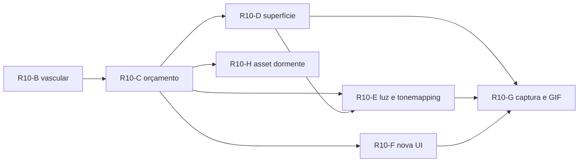

# Plano detalhado 0.10 · A CAPA

**Estado documental:** proposta detalhada, redigida em 13 de agosto de 2026
**Baseline de entrada:** produto `0.9.0` · protocolo/ABI/snapshot `8` · 37 buffers · cinco hashes · R09-A..R09-F e R10-A concluídas
**Relação com o [ROADMAP](ROADMAP.md):** este arquivo é o detalhamento executável dos cortes
`R10-B`..`R10-H`. O ROADMAP continua sendo o índice canônico; a §10 deste plano traz a
tabela pronta que substitui a seção `0.10` de lá quando o primeiro corte abrir. Ao
encerrar a fase, este documento é aposentado em [`docs/legacy/plans`](docs/legacy/README.md)
e cada corte deixa sua própria `AUDIT_0.10_R10_x.md`.

---

## 0 · Premissa, promessa e proibições da fase

A 0.10 deixa de ser uma fase científica e passa a ser **a fase da apresentação**. Ela
responde a uma pergunta prática:

> Como transformar um motor auditado, mas visualmente esquemático, em algo que se lê como
> um **simulador 3D realista de anatomia** — superfície, textura, luz, cor, interação —
> sem inventar um único fato biológico, sem tirar um milissegundo do navegador e mantendo
> o GIF do perfil sincronizado com o que o motor realmente calcula?

Três promessas mensuráveis governam todos os cortes:

| # | Promessa | Como vira número |
| :-- | :-- | :-- |
| P1 | **Nenhuma alegação nova.** Beleza não promove classe epistemológica. | zero objeto sem `STATE`/`TOPOLOGY`/`DECORATION`; zero entrada `CALIBRATED`; toda estrutura nova declara limitação; os cinco hashes ficam idênticos em todos os cortes |
| P2 | **Custo líquido ≤ 0 no navegador.** O realismo é pago com desperdício recuperado, não com orçamento novo. | `frame p95`, draw calls, triângulos e bytes de textura por vista, medidos antes/depois no baseline Intel UHD 770/D3D11 registrado, com gate de CI que falha em regressão |
| P3 | **O GIF não pode divergir do app.** Se o contrato visual mudar e o GIF não for recapturado, a verificação quebra. | `visualContractHash` no manifesto schema 4, recomputado deterministicamente em CI sem abrir navegador |

Proibições que atravessam a fase inteira, herdadas e reforçadas:

- fluxo, pulso, perfusão, oxigenação, velocidade de condução, hemodinâmica ou qualquer
  animação vascular — **VAS-001** continua valendo e a 0.10 não o afrouxa;
- nome de sulco, giro, área de Brodmann, núcleo ou artéria de terceira ordem que a
  geometria procedural não produz de fato;
- atlas, malha, textura ou LUT externa sem manifesto, licença e SHA-256 (R10-H entrega o
  pipeline, não o asset);
- qualquer efeito que só exista com cor (GFX-007) ou que não sobreviva a movimento
  reduzido, monocromia e alto contraste;
- mudança em `dt`, solver, topologia simulada, ABI, protocolo, Worker ou nos cinco hashes.

---

## 1 · Decisões arquiteturais novas

Registrar em [ARCHITECTURE.md](ARCHITECTURE.md) §"Decisões vigentes":

| ID | Decisão | Estado | Reversão exige |
| :-- | :-- | :-- | :-- |
| ARC-019 | **Perfil de renderização** é uma dimensão de apresentação independente do perfil de material: `baseline`, `enhanced` e `cinema`. `cinema` é inalcançável fora do modo de captura. | proposta em R10-C | evidência de que o navegador precisa do perfil de captura |
| ARC-020 | **Topologia vascular é um contrato próprio** (`src/vascular`), separado do catálogo anatômico: o catálogo é uma árvore de contenção; o vascular é um grafo com anastomose. | proposta em R10-B | fonte externa de vasos com geometria própria |
| ARC-021 | **Geometria anatômica de apresentação é procedural, determinística e assada uma vez**; atributos derivados (AO, curvatura, espessura) são pré-computados, nunca por frame. | proposta em R10-D | ingestão de atlas aprovada por R10-H |
| ARC-022 | **Orçamento gráfico é contrato versionado**, não observação: existe artefato, teto por vista e gate de CI. | proposta em R10-C | não há gatilho previsto |
| ARC-023 | **O contrato visual tem hash próprio** e o artefato de captura carrega esse hash; divergência é erro de build, não questão estética. | proposta em R10-G | mudança deliberada de schema do manifesto |
| ARC-024 | **Ingestão de asset externo existe como pipeline dormente**, provado por fixture sintética, com zero asset distribuído. | proposta em R10-H | escolha explícita de fonte/licença pelo mantenedor |

---

## 2 · IDs normativos criados nesta fase

Os intervalos abaixo estão livres hoje; nenhum colide com o que já existe.

### GRAPHICS_SPEC · vascular (VAS)

| ID | Requisito |
| :-- | :-- |
| VAS-002 | todo segmento vascular resolve classe (`arterial`/`venous`/`capillary`), ordem de ramificação, lado, vistas aplicáveis e uma entrada do catálogo anatômico. |
| VAS-003 | a topologia vascular é um grafo validado: sem órfão, sem ID desconhecido, com o anel do polígono de Willis fechado e transição de classe apenas `arterial → capillary → venous`. |
| VAS-004 | direção é comunicada por geometria estática (afunilamento, chevron, posição, rótulo), nunca por animação, e nunca é descrita como fluxo. |
| VAS-005 | arterial, venoso e capilar são distinguíveis sem matiz: forma, espessura, padrão e rótulo redundantes. |
| VAS-006 | o modo “esqueleto vascular” isola vasos preservando contexto residual e não altera hash algum. |
| VAS-007 | toda vista com vascular declara teto de draws, triângulos e memória; ultrapassar o teto degrada LOD, não o contrato. |
| VAS-008 | nenhuma entrada vascular é `STATE`; qualquer promoção futura exige campo publicado, unidade, solver e validação próprios. |

### GRAPHICS_SPEC · apresentação (GFX)

| ID | Requisito |
| :-- | :-- |
| GFX-080 | existem exatamente três perfis de renderização com custo declarado; `baseline` é o padrão e nunca pode custar mais que a medição registrada anterior. |
| GFX-081 | o governador de orçamento mede frame, draws, triângulos e texturas por vista e degrada automaticamente com motivo declarado e recuperável. |
| GFX-082 | geometria anatômica procedural declara seed, stream, algoritmo, contagem de triângulos e hash de geometria de 64 bits. |
| GFX-083 | atributos assados (oclusão, curvatura, espessura) são determinísticos, versionados pelo hash de geometria e nunca reinterpretados como grandeza científica. |
| GFX-084 | tone mapping, exposição e grade fazem parte do contrato de rampa: trocar qualquer um exige reexecutar invertibilidade pixel→estado, saturação, monocromia e contraste, com tolerância por backend. |
| GFX-085 | aproximação de translucidez de tecido usa iluminação por frame já existente; não pode introduzir passe de refração no perfil `baseline`. |
| GFX-086 | névoa, vinheta, grade e rim light são `DECORATION`, removíveis, e não podem esconder nem criar distinção de estado. |
| GFX-087 | destaque de seleção/hover reutiliza material já alocado; nenhum passe novo por objeto apontado. |
| GFX-088 | transições entre escalas preservam continuidade espacial, são puláveis e viram corte instantâneo sob movimento reduzido. |
| GFX-089 | o perfil `cinema` só existe em captura, é determinístico e produz bytes idênticos para o mesmo estado. |
| GFX-090 | a captura declara supersampling, filtro de redução, limiar de alfa, algoritmo de paleta e kernel de dithering. |

### GRAPHICS_SPEC · anatomia/assets (AST)

| ID | Requisito |
| :-- | :-- |
| AST-035 | girificação procedural é ruído determinístico: proibido nomear sulco, giro ou área que o gerador não produz. |
| AST-036 | uma entrada pode ter nomenclatura e conectividade `REFERENCE_GROUNDED` com geometria `ILLUSTRATIVE`; o nível declarado é sempre o **mais fraco** dos dois e a diferença aparece em `claim`/`limitations`. |
| AST-037 | asset externo entra apenas por manifesto validado, com licença, SHA-256, transformação, LOD, contagem de triângulos e script reproduzível; ausência de qualquer campo rejeita a importação. |

### FRONTEND_SPEC (UI/UX)

| ID | Requisito |
| :-- | :-- |
| UI-031 | modos guiado, explorador e laboratório controlam apenas visibilidade/permissão de controle; nunca bifurcam o solver. |
| UI-032 | a paleta de comandos cobre vista, busca anatômica, corte, câmera, perfil e modo, é operável só por teclado e anuncia resultado. |
| UI-033 | apontar/focar uma estrutura mostra nome, ID, classe de proveniência e nível de evidência, com equivalente por teclado e texto. |
| UI-034 | o painel “O que estou vendo?” existe em toda vista e declara modelo, unidade, hipótese e limite. |
| UI-035 | câmera enquadrada por seleção é reversível por `Escape`, restaura o foco e não muda estado científico. |
| UI-036 | pontos de vista salvos, cubo de orientação e trilha de escala são apresentação versionada separadamente do preset científico. |
| UI-037 | o selo de proveniência da seleção é persistente e legível em 390×844. |
| UI-038 | perfil de renderização e degradação automática são visíveis, explicados e reversíveis pelo usuário. |
| UX-003 | a escada encéfalo→região→coluna→patch→neurônio→sinapse é navegável nos dois sentidos, com continuidade espacial e retorno de foco. |

### VALIDATION (QA/SEC/PERF)

| ID | Regra |
| :-- | :-- |
| QA-111 | vascular prova schema/cotas, invariantes de grafo, cobertura de catálogo por objeto, redundância sem cor, ausência de animação, orçamento e invariância dos cinco hashes. |
| QA-112 | orçamento prova medição antes/depois por vista, degradação automática, recuperação e ausência de regressão contra o artefato versionado. |
| QA-113 | superfície procedural prova determinismo, hash de geometria, contagem de triângulos, tempo de construção fora do laço e fallback para a casca anterior. |
| QA-114 | mudança de tone mapping/grade prova invertibilidade pixel→estado, teto de saturação, monocromia estrutural e contraste, com envelope por backend. |
| QA-115 | nova UI prova teclado completo, foco restaurado, live regions, equivalente textual, viewport móvel e movimento reduzido. |
| QA-116 | captura prova determinismo bit a bit, perfil `cinema` inacessível na UI, orçamento de tempo de captura e teto de bytes do GIF. |
| QA-117 | o `visualContractHash` do manifesto é recomputado a partir das fontes e falha o build quando o GIF está defasado. |
| QA-118 | o pipeline de asset externo prova rejeição de manifesto incompleto, licença ausente, SHA-256 divergente, formato fora da lista e excesso de tamanho/triângulos, usando fixture sintética. |
| SEC-021 | o contrato vascular rejeita JSON malformado, campo desconhecido, acima de 128 KiB, referência quebrada e ID duplicado. |
| SEC-022 | a importação de asset nunca busca URL remota, nunca executa código do arquivo e valida integridade antes do parse. |
| PERF-011 | todo passe/atributo/textura novo declara custo medido, teto e fallback antes do merge. |
| PERF-012 | construção de geometria/baking acontece fora do laço de frame e declara tempo máximo observado. |
| PERF-013 | a captura headless declara tempo de parede total e falha quando ultrapassa o orçamento de CI. |

---

## 3 · A escada de qualidade (o coração da fase)

Hoje existe uma dimensão de apresentação (`schematic` ↔ `realistic-illustrative`) e um
único caminho de render: `SelectiveBloomPipeline` desenha a cena **duas vezes** por frame
(composer de bloom com materiais de máscara de profundidade + composer final).

A 0.10 acrescenta uma segunda dimensão, ortogonal:

| Perfil | Onde roda | O que acrescenta | Teto |
| :-- | :-- | :-- | :-- |
| `baseline` | padrão em qualquer navegador | geometria assada, atributos assados, luz e grade sem passe novo | **≤ custo medido hoje**, por vista |
| `enhanced` | opt-in, só se o governador aprovar | AO em meia resolução, antialiasing de tela, LOD alto de vasos | teto declarado por vista; degrada sozinho |
| `cinema` | **somente captura headless** | supersampling 2×, LOD máximo, mais amostras | orçamento de tempo de parede da CI |

Consequência direta da premissa do usuário: **o navegador nunca paga pelo GIF bonito.**
A captura roda em CI, em SwiftShader, com o dobro de resolução e redução determinística;
o app interativo continua no mesmo orçamento de hoje.

E o realismo do perfil `baseline` sai de três lugares que custam zero por frame:

1. **assar** (geometria girificada, oclusão, curvatura, espessura, mapas procedurais);
2. **iluminar melhor** com o mesmo número de passes (tone mapping, rim, névoa, grade
   dobrada no passe de composição que já existe);
3. **devolver desperdício** — as lacunas que o próprio GRAPHICS_SPEC já lista como
   prioritárias (array interpolado por frame, 900 matrizes zeradas por frame, três
   `scene.traverse` completos por frame). Esse é o combustível do orçamento.

---

## 4 · R10-B · vascular topológico

### 4.1 Identidade e valor

| Campo | Conteúdo |
| :-- | :-- |
| ID do corte | `R10-B` |
| Nome | vascular topológico |
| Estado alvo | implementada e validada |
| IDs normativos | VAS-002..VAS-008, AST-036, SEC-021, QA-111, PERF-011 |
| Pergunta | *quais estruturas irrigam e drenam o que este simulador já mostra, e em que ordem de ramificação — sem afirmar uma gota de fluxo?* |
| Valor observável | o usuário isola a árvore arterial, a venosa e a unidade neurovascular, percorre a hierarquia por busca/árvore/picking, entende quem alimenta o córtex que ele está vendo, e lê explicitamente que ali não há hemodinâmica |

### 4.2 Fronteira

**Dentro:** nomenclatura, hierarquia, conectividade topológica, lado, ordem de
ramificação, geometria ilustrativa derivada da nuvem procedural existente, isolamento,
picking, legenda, equivalente textual, orçamento.

**Fora:** fluxo, pulso, perfusão, oxigenação, autorregulação, acoplamento neurovascular
funcional, calibre medido, variação anatômica de sujeito, artéria de terceira ordem,
território de irrigação colorido como se fosse parcelamento, qualquer animação.

### 4.3 Decisão estrutural: dois contratos, não um

O catálogo de R10-A é uma **árvore** (`parentId` único, sem ciclo). A circulação cerebral
tem um **anel** — o polígono de Willis — e confluências venosas. Forçar isso na árvore
produziria uma hierarquia falsa.

Portanto:

- **`src/anatomy/catalog-v1.json`** ganha 44 entradas novas que declaram *identidade,
  contenção, lado, escala, fonte, licença, transformação, evidência e limite*. O
  `parentId` expressa **contenção/agrupamento**, jamais direção de fluxo — isso passa a
  estar escrito na descrição da transformação nova.
- **`src/vascular/vascular-topology-v1.json`** (schema 1, novo) declara o **grafo**:
  segmentos, classe, ordem de ramificação, montante/jusante, anastomose, pontos de
  controle e perfil de raio de apresentação.

Nenhum arquivo duplica o outro: o grafo referencia IDs do catálogo e falha se algum não
existir ou não descender de `vascular-system`.

### 4.4 As 44 entradas do catálogo

Namespace `brain-pro:anatomy/`. Fonte nova `source.vascular-generator`
(`kind: procedural-generator`, `externalAsset: false`, `assetSha256: null`,
`licenseId: "brain-pro-internal"` — `validateAnatomicalCatalog` emite `missing-license`
se a fonte usar qualquer outra licença), `locator:
src/vascular/vascular-geometry.ts#buildVascularGeometry`. Transformação nova
`transform.vascular-procedural`, cuja `description` precisa dizer explicitamente que
`parentId` expressa contenção e **não** direção de fluxo. O catálogo passa de 32 → **76
entradas**, cinco → seis fontes, cinco → seis transformações, e `version` vai de `1.0.0`
para `1.1.0`.

**Raiz e agrupadores (4)**

| ID | Pai | Lado | Escala |
| :-- | :-- | :-- | :-- |
| `vascular-system` | `encephalon` | bilateral | encephalon |
| `arterial-tree` | `vascular-system` | bilateral | region |
| `venous-tree` | `vascular-system` | bilateral | region |
| `neurovascular-unit` | `vascular-system` | not-applicable | synapse |

**Árvore arterial (17)** — pai `arterial-tree`, salvo indicado

`internal-carotid-artery-left` · `internal-carotid-artery-right` ·
`vertebral-artery-left` · `vertebral-artery-right` · `basilar-artery` (midline) ·
`circle-of-willis` (midline) · `anterior-communicating-artery` (midline, pai
`circle-of-willis`) · `posterior-communicating-artery-left` ·
`posterior-communicating-artery-right` (ambos pai `circle-of-willis`) ·
`anterior-cerebral-artery-left` · `anterior-cerebral-artery-right` ·
`middle-cerebral-artery-left` · `middle-cerebral-artery-right` ·
`posterior-cerebral-artery-left` · `posterior-cerebral-artery-right` ·
`pial-arterial-network` (bilateral) · `penetrating-arteriole` (bilateral, pai
`pial-arterial-network`)

**Transição e leito (2)**

`precapillary-arteriole` (pai `penetrating-arteriole`) ·
`capillary-bed` (pai `precapillary-arteriole`)

**Árvore venosa (17)** — pai `venous-tree`, salvo indicado

`postcapillary-venule` · `superficial-cortical-vein` · `deep-cerebral-vein` ·
`internal-cerebral-vein-left` · `internal-cerebral-vein-right` (pai `deep-cerebral-vein`) ·
`basal-vein` (bilateral, pai `deep-cerebral-vein`) · `great-cerebral-vein` (midline) ·
`superior-sagittal-sinus` (midline) · `inferior-sagittal-sinus` (midline) ·
`straight-sinus` (midline) · `confluence-of-sinuses` (midline) ·
`transverse-sinus-left` · `transverse-sinus-right` ·
`sigmoid-sinus-left` · `sigmoid-sinus-right` ·
`internal-jugular-vein-left` · `internal-jugular-vein-right` *(ver nota de fronteira)*

**Unidade neurovascular (4)** — pai `neurovascular-unit`

`capillary-endothelium` · `pericyte` · `astrocyte-endfoot` · `blood-brain-barrier`

**Contagem:** 4 + 17 + 2 + 17 + 4 = **44 entradas novas**; catálogo fecha R10-B com
**76**. Se R10-D catalogar a fissura longitudinal (§6.4), o total passa a 77 — e essa é a
única entrada que a fase pode acrescentar fora deste corte.

**Nota de fronteira:** as jugulares internas ficam **fora do encéfalo**. Elas entram como
*sumidouro declarado do domínio*, com limitação obrigatória: “representa o limite do
domínio modelado; a drenagem extracraniana não é simulada nem desenhada além do primeiro
segmento”.

**Evidência (AST-036).** Cada entrada declara `level: "ILLUSTRATIVE"` — o mais fraco dos
dois níveis — com `claim` na forma:

> “Nomenclatura e conectividade seguem descrição de referência de neuroanatomia; posição,
> calibre e trajeto são procedurais e ilustrativos.”

e no mínimo três limitações, incluindo obrigatoriamente:
“Não há fluxo, perfusão ou oxigenação.”, “Trajeto e calibre não correspondem a nenhum
sujeito.”, “Variação anatômica individual não é representada.”

As entradas da unidade neurovascular acrescentam: “Escala exagerada e rotulada; não é
ultraestrutura medida.”

### 4.5 O contrato de topologia vascular

Arquivo: `src/vascular/vascular-topology-v1.json`
Parser: `src/vascular/vascular-topology.ts` (Zod estrito, mesmo padrão de
`anatomical-catalog.ts`).

```jsonc
{
  "schemaVersion": 1,
  "contractId": "brain-pro-vascular",
  "version": "1.0.0",
  "segments": [
    {
      "id": "brain-pro:vascular/internal-carotid-left",
      "catalogId": "brain-pro:anatomy/internal-carotid-artery-left",
      "class": "arterial",            // arterial | capillary | venous
      "branchOrder": 1,               // ordem topológica de ramificação, NÃO diâmetro medido
      "side": "left",                 // left | right | midline
      "lodTier": 0,                   // 0 macro sempre · 1 médio · 2 micro
      "views": ["overview"],
      "upstreamIds": [],
      "downstreamIds": ["brain-pro:vascular/middle-cerebral-left", "..."],
      "anastomosis": false,
      "directionCue": "taper",        // taper | chevron | none
      "controlPoints": [[x, y, z], "… ≤ 12 pontos, unidade procedural de cena"],
      "radiusProfile": [0.055, 0.038] // apresentação; não é calibre anatômico
    }
  ]
}
```

**Invariantes validadas em código (VAS-003, SEC-021):**

| Regra | Falha se |
| :-- | :-- |
| tamanho | JSON acima de 128 KiB antes do parse |
| schema | campo desconhecido, enum fora do domínio, mais de 12 pontos de controle |
| unicidade | `id` repetido |
| integridade | `catalogId` inexistente ou que não descende de `vascular-system` |
| simetria | `downstreamIds` de A contém B mas `upstreamIds` de B não contém A |
| classe | transição fora de `arterial → capillary → venous` |
| alcance arterial | existe segmento arterial que não alcança `capillary-bed` |
| alcance venoso | existe segmento venoso que não alcança um sumidouro declarado |
| anel de Willis | os segmentos com `anastomosis: true` não formam exatamente um ciclo |
| ordem | `branchOrder` decresce ao descer na árvore arterial ou cresce ao subir na venosa |
| órfão | segmento sem montante e sem jusante |
| vista | segmento cuja vista não está nas `views` da entrada de catálogo correspondente |

`auditVascularTopology()` devolve contagens por classe/vista, o `vascularGeometryHash`
(FNV-1a 64 sobre a serialização canônica dos pontos de controle + raios + classes) e a
lista de problemas, no mesmo formato de `auditAnatomicalCatalog()`.

### 4.6 Geometria e custo

**Módulo:** `src/vascular/vascular-layer.ts` → classe `VascularTopologyModule`.

Ela **não é uma sétima vista**. Expõe `attach(view, root)` e insere um
`THREE.Group` chamado `vascular-<view>` como filho do grupo da vista, para herdar
rotação, clipping, isolamento, opacidade e perfil de material. O módulo é dono dos seus
recursos e tem `dispose()` próprio.

| Vista | O que aparece | Construção | Teto de draws |
| :-- | :-- | :-- | :-- |
| Visão Geral | grandes artérias, polígono de Willis, seios durais, veias corticais | duas `TubeGeometry` mescladas (uma por classe) sobre `CatmullRomCurve3` dos pontos de controle + 1 malha de chevrons estáticos | **≤ 6** |
| Lâminas | arteríolas penetrantes cruzando L1–L6, vênulas | `InstancedMesh` de um cilindro afunilado, 1 por classe | **≤ 3** |
| Célula | um segmento capilar de contexto | 1 malha | **≤ 2** |
| Neurônio | capilar de contexto, desligado por padrão | 1 malha | **≤ 1** |
| Sinapse | endotélio, pericito, pé astrocitário, marcação de BHE | ≤ 5 malhas pequenas | **≤ 5** |
| Eletricidade | nada (prancha esquemática) | — | **0** |

Teto agregado do corte: **≤ 17 draws adicionais**, distribuídos como acima, com
`triangles` e bytes de geometria registrados no artefato. LOD: `lodTier` 2 some em
`baseline` quando o governador (R10-C) sinaliza pressão.

**Regras de implementação inegociáveis:**

- geometria construída **uma vez** no `attach`; zero reconstrução por frame;
  zero `new Vector3`/`new Quaternion` no laço;
- `matrixAutoUpdate = false` em toda a subárvore vascular;
- `declareVisual(obj, "matter", "topology")` — **nenhum objeto vascular é `STATE`** (VAS-008);
- `declareAnatomicalBinding(obj, catalogId)` em todo objeto vascular; nenhum
  `declareNonAnatomical` na subárvore, exceto o rótulo de legenda;
- `excludeFromSelectiveBloom(obj)` em toda a subárvore (vaso não emite);
- `declareClippingParticipation(obj, "include")` — o corte coronal fatia vasos junto com o
  tecido, que é exatamente a leitura didática desejada;
- entradas correspondentes no manifesto de material (`REALISTIC_ILLUSTRATIVE_MANIFEST`)
  com superfície `membrane` e envelope local declarado, para o vaso receber a mesma
  película das demais matérias.

### 4.7 Codificação visual sem depender de cor (VAS-004/005)

| Classe | Matiz (token novo) | Forma | Padrão | Rótulo |
| :-- | :-- | :-- | :-- | :-- |
| arterial | `vascularArterial` | seção circular, afunilamento forte a jusante | chevrons estáticos apontando a jusante | “A · arterial” |
| venoso | `vascularVenous` | seção achatada, calibre mais uniforme | sem chevron, contorno duplo | “V · venoso” |
| capilar | `vascularCapillary` | filamento fino, sem afunilamento | pontilhado | “C · capilar” |

Adicionar os três tokens em `src/render/visual-tokens.ts` e cobrir no teste de monocromia:
com o filtro monocromático ativo, um teste estrutural deve provar que as três classes
continuam separáveis por forma/padrão/rótulo.

**Direção sem fluxo:** o chevron é geometria estática assada na malha. Teste obrigatório:
`vascularAnimatedObjects === 0` — nenhum objeto vascular pode ter atualização por frame.

### 4.8 Interação

- **Busca/árvore:** já funciona via R10-A assim que as entradas existirem; validar
  `arteria cerebral media` → `middle-cerebral-artery-left/right`, `seio sagital` →
  `superior-sagittal-sinus`, `pericito` → `pericyte`.
- **Picking:** `pickAnatomicalEntry()` já ignora não anatômicos; validar que um clique em
  um vaso devolve o mesmo ID da árvore.
- **Modo esqueleto vascular (VAS-006):** novo checkbox + atalho `V`. Esconde matéria não
  vascular e mantém contexto residual (opacidade 0,12) usando o mecanismo de
  `PresentationMaterialEffects` que já existe — sem passe novo.
- **Legenda e limite:** bloco fixo no painel com as três classes, suas pistas redundantes
  e a frase obrigatória: *“Topologia ilustrativa. Não há fluxo, perfusão ou oxigenação.”*
- **Equivalente textual:** tabela DOM com `id`, nome, classe, lado, ordem de ramificação,
  montante, jusante e vista. Navegável por teclado, atualizada com a seleção.

### 4.9 Prova

| Prova | Critério |
| :-- | :-- |
| contrato | Vitest sobre schema, cotas, 12 invariantes de grafo, hash determinístico e rejeição de cada caso malformado (SEC-021) |
| catálogo | 76 entradas, raiz única, zero ciclo, zero lacuna, `CALIBRATED = 0`, toda entrada vascular com ≥ 3 limitações |
| cena | `auditAnatomicalScene()` das seis vistas sem `missingDeclarations`/`unknownEntryIds`; contagem de renderizáveis sobe de 98 para o número medido e **todo** objeto novo está ligado |
| custo | `presentationAudit()` antes/depois por vista dentro dos tetos da §4.6; zero geometria reconstruída por frame; `dispose()` devolve geometrias/materiais/texturas ao valor inicial |
| invariância | relógio congelado por `setCaptureMode(true)`; os cinco hashes idênticos antes/depois de montar, isolar, buscar, apontar e alternar vistas |
| acessibilidade | teclado completo, live region, monocromia estrutural, movimento reduzido (nada anima), 390×844 sem overflow |
| navegador | Chromium/SwiftShader, zero erro de console, capturas por vista |
| ausência de ciência | teste que falha se qualquer objeto vascular declarar `state` ou possuir `visualSemanticBinding` |

**Artefatos:** `artifacts/vascular-audit/vascular-audit.json` (schema 1) + capturas
`01-overview-arterial.png`, `02-overview-venous.png`, `03-laminar-penetrating.png`,
`04-synapse-nvu.png`, `05-skeleton-mode.png`, `06-mobile.png`.
**Script novo:** `npm run audit:vascular` → `scripts/audit_vascular_topology.js`.
**Auditoria:** `AUDIT_0.10_R10_B.md`.

### 4.10 Risco e rollback

| Risco | Mitigação |
| :-- | :-- |
| parecer angiografia clínica | classe `TOPOLOGY` visível, legenda fixa, zero animação, limitações obrigatórias, nome do modo é “esqueleto vascular”, nunca “perfusão” |
| explosão de draws | tubos mesclados por classe, instancing no micro, `lodTier`, teto asseverado em teste |
| tentação de ligar vaso a atividade | VAS-008 + teste que proíbe `state` na subárvore |
| grafo errado passar despercebido | 12 invariantes executáveis, não revisão humana |

**Rollback:** remover `src/vascular` e o `attach` nas seis vistas restaura exatamente as
cenas atuais. As entradas de catálogo são metadados inertes: podem permanecer (com a
versão em `1.1.0`) ou ser revertidas junto. Rust/Wasm/Worker/ABI não são tocados.
**Complexidade/confiança:** alta / alta.

---

## 5 · R10-C · orçamento, governança e reclamação de custo

### 5.1 Por que este corte vem logo depois do vascular

Sem ele, “sem pesar no navegador” é uma intenção. Com ele, é um arquivo versionado e um
gate de CI. E ele **financia** os cortes seguintes: o tempo devolvido paga a girificação e
a iluminação.

### 5.2 Governador

`src/render/presentation-budget.ts`:

- `RenderProfile = "baseline" | "enhanced" | "cinema"`;
- `PresentationBudget` guarda, por vista, tetos de `drawCalls`, `triangles`,
  `textureBytes`, `geometryBytes` e `frameMillisecondsP95`;
- `RenderProfileGovernor.observe(sample)` degrada `enhanced → baseline` após N frames
  consecutivos acima do teto, com motivo (`"frame-budget-exceeded"`), histerese para não
  oscilar, e recuperação manual explícita pelo usuário;
- `cinema` só é aceito quando `captureMode === true`; qualquer outra tentativa lança;
- `budgetAudit()` entra no `presentationAudit()` e no hook de auditoria.

### 5.3 Reclamação de desperdício (a lista executável)

| # | Onde | Problema hoje | Ação |
| :-- | :-- | :-- | :-- |
| 1 | `brain-layer.ts:341` | `new Float32Array(...)` por frame | buffer pré-alocado no construtor, redimensionado só quando a topologia muda |
| 2 | `brain-layer.ts:447-452` | 900 matrizes zeradas todo frame | manter `lastInstanceCount` e limpar apenas o intervalo sujo |
| 3 | `selective-bloom.ts:106-117` | `scene.traverse()` completo **por frame**, trocando material de todo objeto | partição `emission`/`matter` em cache, invalidada por revisão do scene graph; e pular o composer de bloom inteiro quando a vista ativa não tem objeto de emissão visível |
| 4 | `material-profile.ts:642` | `beforeRender` percorre a raiz da vista ativa **todo frame** e muta material a material | lista de materiais em cache por (vista, revisão do scene graph) |
| 5 | `clipping.ts` | travessia por `update()`/`refresh()` | mesma estratégia de cache com invalidação explícita |
| 6 | cenas estáticas | matrizes recalculadas | `matrixAutoUpdate = false` + `updateMatrix()` manual nas subárvores estáticas |
| 7 | `main.ts:774-775` | `updatePresentationCostUi()` e `updateCutProbe()` a cada frame | mover para cadência de UI (≤ 10 Hz), como já é feito com métricas |

Cada item entra com **medição antes/depois** no artefato. Nenhum deles muda pixel, ordem
de desenho ou hash — e isso precisa ser provado, não afirmado: um teste de captura
compara frames renderizados antes/depois dentro da tolerância declarada.

### 5.4 Prova

| Prova | Critério |
| :-- | :-- |
| artefato | `artifacts/presentation-budget/presentation-budget.json` schema 1, com ambiente, GPU, perfil, e por vista: draws, triângulos, texturas, geometria, `frame p50/p95` |
| gate | `npm run verify:presentation-budget` falha se `baseline` regredir além da tolerância declarada contra o artefato anterior |
| degradação | teste força estouro sintético e verifica demoção, motivo, anúncio na UI e recuperação |
| isolamento | teste prova que `cinema` é rejeitado fora de `captureMode` |
| equivalência visual | frames antes/depois das sete reclamações dentro da tolerância de pixel por backend |
| invariância | cinco hashes idênticos |

**Auditoria:** `AUDIT_0.10_R10_C.md`. **Complexidade/confiança:** média / alta.

---

## 6 · R10-D · superfície anatômica procedural

### 6.1 O problema visual real

A Visão Geral usa `ConvexGeometry` sobre ~180 pontos amostrados (`brain-layer.ts:254`).
Isso produz um poliedro convexo — a leitura é “nuvem com casca”, nunca “encéfalo”. É a
maior distância entre o que o projeto é e o que ele parece ser.

### 6.2 A solução determinística

`src/render/procedural-surface.ts` → `buildCorticalSurface(region, brainData, options)`:

1. **Base:** icosfera subdividida; contagem declarada por região.
2. **Ajuste de forma:** deformação radial da icosfera para envolver a nuvem de pontos da
   região (função de base radial sobre os mesmos nós procedurais) — a superfície continua
   *derivada da mesma topologia*, o que preserva a proveniência.
3. **Girificação:** deslocamento por ruído 3D com *domain warping*: 3 oitavas de simplex,
   função de crista `1 − |n|` para gerar sulcos em vez de bolhas, amplitude e frequência
   por região (cerebro ≠ cerebelo: o cerebelo recebe uma banda de alta frequência
   quase paralela, imitando fólias).
4. **Fissura longitudinal:** achatamento da face medial de cada hemisfério, para que a
   separação leia corretamente.
5. **Assar atributos:** `aoFactor` (oclusão por amostragem de hemisfério ou proxy de
   curvatura), `curvature` e `thickness` (distância aproximada à superfície) como
   `BufferAttribute`s.
6. **LOD:** dois níveis construídos uma vez; o governador escolhe.
7. **Hash:** `surfaceGeometryHash` FNV-1a 64 sobre posições quantizadas + atributos,
   exatamente como `NeuronRenderLayer` já faz com a morfologia (AST-010/GFX-082).

### 6.3 Orçamento

| Item | Teto proposto | Como validar |
| :-- | :-- | :-- |
| triângulos totais das quatro regiões | ≤ 52.000 (LOD 0) / ≤ 14.000 (LOD 1) | contador do artefato |
| tempo de construção + baking | ≤ 120 ms somados, **fora do laço de frame** (PERF-012) | medição registrada; construção durante a inicialização com estado de progresso |
| custo por frame | zero CPU adicional; delta de GPU medido e coberto pelo que R10-C devolveu | orçamento antes/depois |

### 6.4 Honestidade obrigatória (AST-035)

- as entradas de catálogo das quatro regiões ganham a limitação: *“Girificação procedural:
  o padrão de sulcos é ruído determinístico e não corresponde a sulcos nomeados.”*;
- **proibido** criar entrada para sulco central, fissura de Sylvius, lobos ou áreas — o
  gerador não os produz;
- a fissura longitudinal pode ser catalogada como `longitudinal-fissure` **apenas** porque
  é geometricamente construída de propósito, e mesmo assim como `PROCEDURAL` com limite
  explícito.

### 6.5 Prova e rollback

Determinismo (mesma seed → mesmo hash em duas execuções e em dois ambientes), contagem de
triângulos, tempo de construção, fallback atômico para `ConvexGeometry` em caso de falha
ou estouro, sonda de corte continuando válida (a transformação posição→campo muda de
malha! **o mapeamento da sonda precisa ser reavaliado e reprovado**, senão a leitura do
campo passa a mentir), cinco hashes invariantes.

**Auditoria:** `AUDIT_0.10_R10_D.md`. **Complexidade/confiança:** alta / média-alta.

---

## 7 · R10-E · iluminação, tone mapping e materialidade

### 7.1 Conteúdo

| Item | O que muda | Custo |
| :-- | :-- | :-- |
| tone mapping | `ACESFilmicToneMapping` → `AgXToneMapping` (ou `NeutralToneMapping`), com `OutputPass` no fim do composer final | nulo |
| translucidez de tecido | remover `transmission > 0` do perfil `baseline` e substituir por SSS aproximado: *wrap diffuse* + Fresnel + atributo `thickness` assado, injetado por `onBeforeCompile` | **negativo** — remove um render inteiro |
| ambiente | trocar `RoomEnvironment` por um gradiente de estúdio procedural convertido por PMREM | igual |
| luz | trio key/fill/rim recalibrado; rim traseiro define silhueta | igual |
| grade e névoa | vinheta, *lift/gamma/gain* sutil e névoa exponencial por vista, dobrados no passe de composição que **já existe** | nulo |
| oclusão | sem passe: usa o `aoFactor` assado em R10-D. `GTAOPass` em meia resolução fica reservado ao perfil `enhanced`, **e só entra se a medição provar que cabe** | condicional |

### 7.2 Por que remover `transmission` é ganho, e não perda

Hoje `surfaceParameters()` dá `transmission = 0,10` ao tecido e `0,22` à membrana. No
Three.js, qualquer material transmissivo visível dispara `renderTransmissionPass()`:
a cena opaca é **renderizada outra vez** num render target próprio, com geração de mipmap,
a cada `render()` do composer final. Ou seja, a película realista de hoje custa um render
inteiro de cena por frame que quase ninguém percebe como refração — porque a escala dos
objetos e a opacidade baixa quase não deixam ver o efeito.

A troca por SSS aproximado (wrap + Fresnel + `thickness` assado, dentro do shader que já
roda) devolve esse render e, na prática, produz uma leitura de tecido **melhor**, porque
a espessura passa a ser real (assada da geometria) em vez de constante por superfície.

Alavanca intermediária, se a medição mostrar que vale manter refração em algum objeto:
`renderer.transmissionResolutionScale` permite o passe em resolução reduzida. Só entra no
perfil `enhanced`, com custo medido.

### 7.3 O risco que este corte carrega

Trocar tone mapping muda **todos os pixels**. Os gates de cor da 0.8 (invertibilidade
pixel→estado, teto de saturação, monocromia, contraste) foram fechados sob ACES. Este
corte precisa:

1. reexecutar `renderedStateAudit()`/`auditRenderedStatePixels` e **redeclarar** a
   tolerância por backend;
2. reexecutar o gate de saturação/bloom;
3. reexecutar o gate monocromático estrutural;
4. reexecutar contraste de texto ≥ 4,5:1;
5. manter uma flag de reversão para ACES até que os quatro fechem.

Se qualquer um não fechar, o corte entrega apenas luz/grade/SSS e adia o tone mapping.
Isso precisa estar escrito na auditoria, não decidido no calor do momento.

**Auditoria:** `AUDIT_0.10_R10_E.md`. **Complexidade/confiança:** média / média.

---

## 8 · R10-F · nova UI e interação

### 8.1 Diagnóstico

O shell atual é um painel de vidro com `<details>` empilhados e 20+ sliders. É denso,
funcional e nada intuitivo. `main.ts` tem 1.679 linhas e concentra composição, bindings,
métricas, captura e frame — o próprio FRONTEND_SPEC já nomeia os seis controllers que
deveriam existir.

### 8.2 Entregas

| Entrega | Descrição | Custo GPU |
| :-- | :-- | :-- |
| **Modos** (UI-031) | `guiado` / `explorador` / `laboratório` controlam quais controles aparecem. Padrão: guiado. Só apresentação — o solver é o mesmo | zero |
| **Paleta de comandos** (UI-032) | `Ctrl/Cmd+K`: vistas, busca anatômica, cortes, câmeras, perfis, modos. Só DOM, totalmente por teclado | zero |
| **Hover/foco → destaque** (UI-033, GFX-087) | rim emissivo por troca de parâmetro no material já alocado (nunca `OutlinePass`), + rótulo DOM posicionado por projeção mundo→tela | zero passes novos |
| **Painel “O que estou vendo?”** (UI-034) | por vista e por seleção: modelo, unidade, hipótese, limite | zero |
| **Selo de proveniência** (UI-037) | classe (`STATE`/`TOPOLOGY`/`DECORATION`) + nível de evidência da seleção, sempre visível. **Mitigação direta de RSK-05**: quanto mais bonito, mais necessário | zero |
| **Câmera** (UI-035/036) | enquadrar seleção, `Escape` volta e restaura foco, pontos de vista salvos, cubo de orientação em SVG/DOM (não em WebGL) | zero |
| **Transições de escala** (UX-003, GFX-088) | encéfalo→coluna→patch→neurônio→sinapse com continuidade espacial, puláveis, corte seco sob movimento reduzido | mínimo, medido |
| **Toque/móvel** | painéis viram *bottom sheet* em 390×844; alvos mínimos; nada crítico escondido | zero |
| **Decomposição de `main.ts`** | extrair `engine-client`, `app-state`, `view-controller`, `metrics-controller`, `capture-controller`, `experiment-controller` conforme FRONTEND_SPEC | zero |

A decomposição pode ser feita em PR separada dentro do mesmo corte, com a regra: nenhuma
mudança de comportamento junto de mudança de estrutura.

**Prova:** testes de DOM/interação, mapa de teclado documentado e testado, foco restaurado,
live regions, equivalente textual de tudo que é gráfico, 390×844, movimento reduzido,
`prefers-reduced-motion`, e os cinco hashes invariantes sob qualquer interação.

**Auditoria:** `AUDIT_0.10_R10_F.md`. **Complexidade/confiança:** alta / média-alta.

---

## 9 · R10-G · captura cinema e GIF sincronizado

Este é o corte que responde ao desafio literal: *GIF sincronizado com as mudanças, sem
pesar em nada no navegador.*

### 9.1 Supersampling que o navegador nunca vê

Mecanismo primário — **não** mexer no pipeline:

1. `page.setViewport({ width: 1520, height: 860, deviceScaleFactor: 1 })` (2× linear);
2. capturar o PNG em 2×;
3. **chavear o fundo antes de reduzir**, sobre a imagem 2×, com o limiar atual;
4. reduzir para 760×430 por média 2×2 exata com alfa pré-multiplicado (função pura em
   Node, testada, determinística — `scripts/downsample.js`);
5. limiar de alfa em 50% na saída, porque GIF só tem 1 bit de transparência; o limiar
   entra no manifesto (GFX-090).

Isso dá antialiasing de qualidade em **todo** o pipeline (inclusive bloom e refração),
sem tocar em `SelectiveBloomPipeline` e sem risco para o caminho interativo.
`SSAARenderPass` fica registrado como alavanca adicional, ativável só se a medição de
tempo de CI permitir.

### 9.2 Qualidade do GIF em 256 cores

Superfícies suaves + gradiente = *banding* em paleta indexada. Contramedida determinística
e sem dependência nova: **dithering ordenado Bayer 8×8** aplicado antes da quantização,
implementado no repositório como função pura com teste próprio. Avaliar `octree` contra
`neuquant` medindo bytes e erro; registrar a escolha no manifesto.

### 9.3 Orçamento de bytes e de tempo

| Grandeza | Teto | Ação ao estourar |
| :-- | :-- | :-- |
| bytes do GIF | **≤ 2,5 MiB** (a CI já barra em 5 MiB) | reduzir, nesta ordem: qualidade da paleta → número de quadros → dimensão. Nunca remover vista |
| tempo de parede da captura | orçamento explícito dentro dos 20 min do workflow (PERF-013) | reduzir supersampling para 1,5×, depois desligar |

Antes de escolher os números, **medir** o tempo atual da captura (60 quadros,
SwiftShader) e o tempo com 2×. A decisão vira número no artefato, não estimativa.

### 9.4 Coreografia v2

Manter 60 quadros e 120 ms (o tamanho é função direta disso), redistribuindo:

| Vista | Hoje | Proposto | Por quê |
| :-- | --: | --: | :-- |
| Visão Geral | 15 | 18 | é a heroína: girificação + vascular + corte coronal |
| Lâminas | 9 | 9 | — |
| Célula | 9 | 8 | — |
| Neurônio | 9 | 9 | — |
| Eletricidade | 9 | 7 | prancha é estática por natureza |
| Sinapse | 9 | 9 | — |
| **total** | **60** | **60** | orçamento de bytes preservado |

Cada vista ganha uma coreografia de câmera declarada em tabela (posição inicial/final,
alvo, corte ativo), determinística e versionada — hoje só existe rotação global.

### 9.5 O mecanismo de sincronia (a peça central)

`scripts/visual_contract.js` exporta `computeVisualContract()`, que compõe:

```
{
  catalogVersion, catalogFingerprint,        // src/anatomy/catalog-v1.json
  vascularVersion, vascularGeometryHash,     // src/vascular/vascular-topology-v1.json
  surfaceGeometryHash,                       // buildCorticalSurface, executável em Node
  materialProfileId, renderProfileId,
  toneMapping, exposure,
  frameSchedule,                             // a tabela da §9.4
  supersample, downsampleFilter, alphaThreshold,
  paletteAlgorithm, ditherKernel
}
→ visualContractHash (FNV-1a 64 sobre a serialização canônica)
```

Todos os insumos são **puros e computáveis em Node, sem navegador**: JSONs versionados,
constantes e um gerador de geometria que é matemática pura.

- `gen_brain_gif.js` grava `visualContractHash` no manifesto **schema 4**;
- `verify_brain_gif.js` recomputa o hash a partir das fontes e falha se divergir do
  manifesto (QA-117);
- `sync-brain-gif.yml` passa a observar também `src/vascular/**`, `src/anatomy/**`,
  `src/render/**` e `scripts/visual_contract.js`.

Resultado prático: **mudou a aparência e não recapturou o GIF? o build quebra.** Isso é o
“sincronizado” deixando de ser disciplina humana e virando propriedade do sistema — e
custa milissegundos de CPU em CI, zero no navegador.

### 9.6 Manifesto schema 4

Preserva tudo do schema 3 (commit, SHA-256 do GIF, runtime, ABI, cinco hashes, `degraded`,
`framesByView`, `presentation`) e acrescenta: `visualContractHash`, `renderProfile`,
`supersample`, `downsampleFilter`, `alphaThreshold`, `paletteAlgorithm`, `ditherKernel`,
`gifBytes`, `captureWallClockSeconds`, `catalogVersion`, `vascularVersion`,
`surfaceGeometryHash`, `cameraChoreographyVersion`.

`verifyBrainGifManifest` ganha os testes correspondentes, incluindo rejeição de manifesto
schema 3 e de `renderProfile !== "cinema"`.

### 9.7 Prova

Determinismo bit a bit (capturar 3 quadros duas vezes e comparar bytes — 60 seria caro
demais em CI), `cinema` inacessível pela UI, tetos de bytes e tempo, transparência
preservada em fundo claro e escuro do GitHub, e o gate de sincronia falhando de propósito
num teste que altera uma constante do contrato.

**Auditoria:** `AUDIT_0.10_R10_G.md`. **Complexidade/confiança:** alta / alta.

---

## 10 · R10-H · pipeline de asset externo (dormente)

Entrega **o caminho**, não o asset. Zero bytes de terceiros entram no repositório.

- `src/assets-pipeline/asset-manifest.ts`: schema 1 estrito com origem, licença
  (expressão SPDX ou `LicenseRef-`), titular, versão, arquivo, **SHA-256**, data de
  obtenção, unidade, escala, orientação, sistema de coordenadas, transformação, IDs
  semânticos, triângulos, vértices, LODs, compressão, ferramenta/versão e script
  reproduzível (AST-037);
- carregador estrito: apenas glTF/GLB de arquivo local, **nunca URL remota**, integridade
  verificada **antes** do parse, tetos de bytes/triângulos/vértices, sem execução de
  código embutido (SEC-022);
- fixture sintética: um GLB minúsculo gerado por script no próprio repositório prova o
  caminho ponta a ponta e os oito casos de rejeição (QA-118);
- **registro de decisão** com as fontes candidatas e o que cada licença obriga
  (atribuição, *share-alike*, restrição não comercial), para que a escolha futura seja uma
  tarefa de um dia e não uma pesquisa do zero.

Quando o mantenedor escolher a fonte, o corte que a incorporar é um `R11-x` próprio, com
sua auditoria de licença e sua remedição de orçamento.

O detalhamento executável da ingestão — convenção de nomes, mapa de binding, exigências do
exportador glTF, orçamento de normal maps, calibração PBR de tecido úmido, proxies de tampa
stencil e vínculo de estado sem alocação — está em
[PLAN_0.10_ASSET_REALISM.md](PLAN_0.10_ASSET_REALISM.md).

**Auditoria:** `AUDIT_0.10_R10_H.md`. **Complexidade/confiança:** média / alta.

---

## 11 · Ordem, dependências e paralelismo



- **R10-B** abre a fase porque já era o próximo gate declarado e porque é autocontido;
  ele carrega o próprio teto de custo.
- **R10-C** vem logo em seguida porque nenhum corte posterior pode provar “custo ≤ 0” sem
  ele — e porque devolve o orçamento que D e E vão gastar.
- **R10-D** e **R10-E** são sequenciais (a luz depende dos atributos assados), mas **F**
  corre em paralelo: é DOM, não GPU.
- **R10-G** fecha a fase porque precisa do contrato visual estável.
- **R10-H** pode ser feito a qualquer momento depois de C; é isolado.

Regra de WIP, herdada do princípio 10 do programa: **no máximo dois cortes abertos**, um
gráfico e um de UI.

---

## 12 · Riscos novos da fase

| ID | Risco | Prob./impacto | Indicador | Mitigação | Residual |
| :-- | :-- | :-- | :-- | :-- | :-- |
| RSK-11 | realismo corroer o baseline de desempenho | alta/alta | `frame p95` acima do artefato anterior | governador + gate de CI + reclamação prévia (R10-C) | baixo |
| RSK-12 | GIF divergir silenciosamente do app | alta/média | manifesto com hash antigo | `visualContractHash` recomputado em CI | muito baixo |
| RSK-13 | GIF crescer e pesar no perfil | média/média | bytes acima de 2,5 MiB | governador de bytes com ordem de alavancas declarada | baixo |
| RSK-14 | tone mapping quebrar gates de cor da 0.8 | média/alta | invertibilidade/contraste fora da tolerância | corte próprio, flag de reversão, quatro gates reexecutados | médio |
| RSK-15 | vascular ser lido como angiografia | média/alta | linguagem clínica em UI/README | classe TOPOLOGY visível, zero animação, legenda fixa, limitações obrigatórias | baixo |
| RSK-16 | girificação sugerir sulcos reais | média/alta | entrada de catálogo com nome de sulco | AST-035 + revisão do catálogo no gate | baixo |
| RSK-05 (herdado) | beleza parecer validação | alta/alta | asset/objeto sem classe | selo de proveniência persistente (UI-037) | médio |

---

## 13 · Definição de pronto da 0.10

A fase só fecha quando, simultaneamente:

- os sete cortes têm auditoria própria, sem achado alto aberto;
- os **cinco hashes** são idênticos ao baseline de entrada em todos os artefatos;
- o artefato de orçamento prova `baseline` **igual ou mais barato** que a medição de
  entrada, com vascular, girificação e nova iluminação ativos;
- `npm run check` e todos os `audit:*` passam, incluindo `audit:vascular` e
  `verify:presentation-budget`;
- o catálogo tem 76 entradas, zero `CALIBRATED`, zero asset externo e cobertura total dos
  objetos renderizáveis (nenhuma lacuna nova);
- o GIF foi recapturado, está abaixo do teto de bytes e o `visualContractHash` bate;
- ROADMAP, ARCHITECTURE, GRAPHICS_SPEC, FRONTEND_SPEC e VALIDATION incorporaram os IDs
  novos e este plano foi movido para `docs/legacy/plans`;
- README descreve o que passou a existir **e o que continua não sendo verdade**.

---

## 14 · Fase 1.0 · polimento e estabilização

A 1.0 não acrescenta capacidade: ela transforma o que a 0.10 entregou em algo estável,
medido e defensável.

| Corte | Conteúdo | Aceite |
| :-- | :-- | :-- |
| R11-A · matriz de ambientes | medição em SwiftShader, Intel integrado, GPU discreta e móvel; perfis e degradação verificados em cada um | artefato por ambiente, sem promessa fora do medido |
| R11-B · acessibilidade ponta a ponta | teclado completo, leitores de tela, contraste, monocromia, movimento reduzido, toque, 390×844 e perfis maiores | relatório com cada critério e evidência |
| R11-C · estabilização de superfície | `__BRAIN_ENGINE__` vira superfície de auditoria versionada e documentada; presets de apresentação e científicos versionados com migração | schema, migração e teste de compatibilidade |
| R11-D · dívida estrutural | conclusão da decomposição de `main.ts` nos seis controllers, sem mudança de comportamento | testes idênticos antes/depois, cobertura por controller |
| R11-E · documentação de limites | glossário, classes epistemológicas, o que o projeto **não** afirma, proveniência de cada camada | um documento canônico, sem duplicar spec |
| R11-F · release reproduzível | build web + Tauri determinístico, assinável, `dist` verificável | artefato de release e instruções executadas |
| R11-G · promoção | auditoria de promoção 1.0 agregando os anteriores | zero requisito crítico sem teste; nenhum achado alto aberto |

**Migram para 1.1** (o que hoje é 0.11): timeline/replay, comparação lado a lado, catálogo
de experimentos, observáveis (pseudo-LFP, espectro) e persistência local. Nenhum deles é
requisito de uma 1.0 cujo objetivo declarado é consolidar o que existe.

---

## 15 · Patch pronto para o ROADMAP

Substituir a seção `## 0.10 · anatomia com proveniência e transmissão de volume` por:

```markdown
## 0.10 · a capa: apresentação, anatomia e captura

| Corte | Estado | Contrato e dependências | Aceite principal | Risco/rollback |
| :-- | :-- | :-- | :-- | :-- |
| R10-A · catálogo anatômico | implementada e validada em 13 de agosto de 2026 | schema 1 com 32 IDs | 98 objetos cobertos; cinco hashes invariantes | zero asset externo |
| R10-B · vascular topológico | planejada | 44 entradas de catálogo + contrato de grafo próprio; VAS-002..008, SEC-021, QA-111 | grafo validado, ≤ 17 draws, zero animação, cobertura total, cinco hashes | aparência clínica; remover `src/vascular` |
| R10-C · orçamento e reclamação | planejada | perfis de render, governador e sete reclamações; GFX-080/081, PERF-011..013, QA-112 | `baseline` ≤ custo medido anterior, com gate de CI | desligar governador e manter perfil único |
| R10-D · superfície procedural | planejada | girificação e atributos assados; GFX-082/083, AST-035, QA-113 | determinismo, hash, triângulos e tempo dentro do teto | voltar a `ConvexGeometry` |
| R10-E · luz e tone mapping | planejada | AgX, SSS aproximado, grade; GFX-084..086, QA-114 | quatro gates de cor reexecutados e redeclarados | flag de reversão para ACES |
| R10-F · nova UI e interação | planejada | modos, paleta, selo de proveniência, escada de escalas; UI-031..038, UX-003, QA-115 | teclado, foco, equivalente textual, móvel | manter painel atual |
| R10-G · captura cinema e GIF | planejada | perfil `cinema`, supersampling, manifesto schema 4; GFX-089/090, QA-116/117 | determinismo, teto de bytes/tempo e sincronia verificada | voltar ao schema 3 |
| R10-H · asset externo dormente | planejada | manifesto/carregador estrito e fixture sintética; AST-037, SEC-022, QA-118 | oito rejeições provadas, zero asset distribuído | remover o pipeline |

Detalhamento executável em [PLAN_0.10.md](PLAN_0.10.md). Reação–difusão e mapas
químicos saem desta fase e passam a compor a trilha de pesquisa pós-1.0.
```

E, na abertura do arquivo, trocar **Próximo gate** para `R10-B · vascular topológico
(detalhado em PLAN_0.10.md)`.

---

## 16 · Referências consultadas para o conteúdo anatômico

O conteúdo vascular é **nomenclatura e conectividade de referência**, não medida. As
fontes abaixo entram em [REFERENCES.md](REFERENCES.md) junto com o corte R10-B:

- Purves et al., *Neuroscience* — “The Blood Supply of the Brain and Spinal Cord”
  ([NCBI Bookshelf NBK11042](https://www.ncbi.nlm.nih.gov/books/NBK11042/));
- *The Cerebral Circulation* — “Anatomy and Ultrastructure”
  ([NCBI Bookshelf NBK53086](https://www.ncbi.nlm.nih.gov/books/NBK53086/));
- TeachMeAnatomy — [suprimento arterial](https://teachmeanatomy.info/neuroanatomy/vessels/arterial-supply/),
  [drenagem venosa](https://teachmeanatomy.info/neuroanatomy/vessels/venous-drainage/) e
  [seios durais](https://teachmeanatomy.info/neuroanatomy/vessels/dural-venous-sinuses/);
- unidade neurovascular e BHE —
  [Cells of the Blood-Brain Barrier (PMC9987262)](https://pmc.ncbi.nlm.nih.gov/articles/PMC9987262/) e
  [Pericyte Control of Blood Flow across Microvascular Zones (PMC10480047)](https://pmc.ncbi.nlm.nih.gov/articles/PMC10480047/);
- Kandel et al., *Principles of Neural Science* — eixo de estudo do projeto.

Citar uma fonte de nomenclatura **não** promove a geometria: ela continua ilustrativa e
procedural, e cada entrada precisa dizer isso (AST-036).
