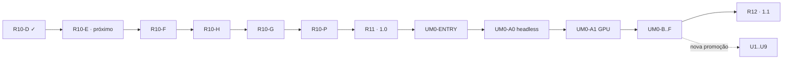

# Roadmap canônico · BRAIN PRO e Unrail Motor

**Revisão:** 2 · 21 de agosto de 2026

**Produto declarado nos manifests:** `0.9.0`

**Baseline promovida:** `0.8`

**Desenvolvimento:** R09-A..R09-F e R10-A..R10-D concluídos

**Próximo gate global:** `R10-E` · luz, tone mapping e materialidade

Este é o único roadmap ativo. Planos detalham cortes; backlogs preservam
hipóteses; nenhum deles cria uma fila paralela. Histórico substituído permanece
em [`docs/legacy`](../legacy/README.md) e no Git.

## Norte do produto

O BRAIN PRO é um simulador local-first, determinístico, educacional e
experimental. Ele conecta modelos neurais e bioquímicos explicitamente
limitados a uma apresentação 3D auditável. Não é instrumento clínico,
diagnóstico ou prognóstico; realismo visual nunca é evidência biológica.

O Unrail Motor é uma direção arquitetural nativa de longo prazo. Ele poderá
consumir `brain-engine`, mas não substitui a ciência, a ABI Wasm, a pilha web ou
os gates visuais já promovidos.

## Governança

1. WIP global é 1: somente um corte pode estar em implementação.
2. Código → testes/fixtures → manifests → auditorias → especificações → roadmap
   → planos/backlogs é a ordem de precedência factual.
3. Todo corte possui problema, valor, fronteira, dependências, owner de estado,
   prova reproduzível, segurança, desempenho e rollback.
4. Rust continua sendo a única fonte de equações, estado científico, RNG,
   eventos, solvers, hashes e replay.
5. Apresentação, câmera, LOD, cor, corte e FPS não escolhem ciência.
6. Todo objeto visual declara `STATE`, `TOPOLOGY` ou `DECORATION`.
7. Dependência externa exige pacote/versão, SPDX, features mínimas, lock, SBOM,
   advisory policy e fachada quando cruzar fronteira pública.
8. Um crate nasce apenas por isolamento mensurável de risco, ownership,
   compilação ou reúso; catálogo futuro não autoriza scaffolding vazio.

## Estado verdadeiro

| Eixo | Estado | Evidência/limite |
| :-- | :-- | :-- |
| ciência | `brain-engine`; passo fixo, replay e cinco hashes | validade restrita às fixtures e ambientes promovidos |
| protocolo | Worker/ABI/snapshot `8`, 37 buffers | host rejeita divergência de schema |
| visual web | seis vistas, catálogo anatômico, vascular e superfície procedural em dois LODs | [auditorias 0.10](../audits/0.10/) |
| orçamento gráfico | perfis `baseline`, `enhanced`, `cinema`; GPU física registrada | R10-E deve provar custo contra R10-C |
| último gate | R10-D, 5.780/1.500 triângulos, build 77,9 ms, hash `7dfdd64207190121` | [auditoria](../audits/0.10/AUDIT_0.10_R10_D.md) |
| Unrail | direção documental adotada; zero código, zero dependência, zero `engine/` | [índice arquitetural](../specifications/unrail/README.md) |
| contradição C-09 | host Tauri publica apenas schema; runner científico nativo ausente | só pode fechar em `UM0-F` |

## Fila global

| Ordem | Gate | Estado | Resultado promovível |
| --: | :-- | :-- | :-- |
| 1 | `R10-E` · luz/materialidade | **próximo** | volume, separação de planos e pele úmida ilustrativa sem regressão científica ou de baseline |
| 2 | `R10-F` · UI/interação | planejado | modos, escala, foco, proveniência e navegação acessível |
| 3 | `R10-H` · asset dormente | planejado | pipeline estrito provado por fixture sintética; zero asset externo distribuído |
| 4 | `R10-G` · captura/GIF | planejado | perfil cinema e manifesto sincronizado com gerador visual |
| 5 | `R10-P` · promoção 0.10 | planejado | auditoria agregada, docs e artefatos coerentes |
| 6 | `R11-A..G` · estabilização 1.0 | planejado | ambientes, acessibilidade, compatibilidade, dívida, limites e release reproduzível |
| 7 | `UM0-ENTRY` · decisão nativa | planejado | go/no-go, grafo mínimo, toolchain/dependências/CI e fixture científica fechados |
| 8 | `UM0-A0..F` · `unrail-engine 0.1.0` | condicionado | runner headless antes de janela/GPU; C-09 fecha somente no último corte |
| 9 | `R12-A..G` · BRAIN PRO 1.1 | backlog | replay, comparação, experimentos, observáveis, persistência e realismo multiescala |
| 10 | `U1..U9` · horizontes Unrail | não agendado | somente uma nova decisão canônica pode promover capacidades |

## Ciclo 0.10 · apresentação, anatomia e captura

O contrato executável completo está no [plano 0.10](PLAN_0.10.md).

| Gate | Estado | Aceite principal | Rollback |
| :-- | :-- | :-- | :-- |
| R10-A · catálogo anatômico | concluído em 13 ago 2026 | schema, busca, bindings e cinco hashes | remover explorador/bindings |
| R10-B · vascular topológico | concluído em 13 ago 2026 | 42 segmentos, 12 draws, grafo/picking e hashes | remover `src/vascular` |
| R10-C · orçamento | concluído em 20 ago 2026 | seis vistas × 24 amostras, governador e baseline física | manter `enhanced`, desligar governador |
| R10-D · superfície procedural | concluído em 21 ago 2026 | dois LODs, hash, atributos assados e p95 no orçamento | `ConvexGeometry` atômica |
| R10-E · luz/materialidade | em andamento · cortes 1–4 | gates de cor, custo físico, cinco hashes e comparação estética multiperspectiva | feature para ACES/material anterior |
| R10-F · UI/interação | planejado | teclado, foco, equivalente textual, móvel e movimento reduzido | manter painel atual |
| R10-H · asset dormente | planejado | oito rejeições, manifesto/licença/hash, zero asset distribuído | remover pipeline |
| R10-G · captura/GIF | planejado | determinismo, bytes/tempo e manifesto schema 4 sincronizado | schema 3 |
| R10-P · promoção | planejado | auditoria agregada sem achado alto e documentação sincronizada | manter 0.9.0 |

### Regra visual de R10-E em diante

Cada gate gráfico compara ao menos as vistas frontal, lateral, superior, oblíqua
e coronal em três referências distintas: fotografia anatômica, render didático
realista e captura anterior do próprio produto. A revisão avalia:

- silhueta e proporção antes de microdetalhe;
- leitura de profundidade por key/fill/rim, AO assada e tone mapping;
- resposta de material por região, sem plástico uniforme ou bloom mascarando forma;
- continuidade entre córtex, cerebelo, tronco, vasos e planos de corte;
- informação recuperável em monocromia e sob movimento reduzido;
- custo por perfil e invariância dos cinco hashes.

Fotos orientam escala, luz e material. A imagem final continua rotulada como
ilustrativa e não clínica. As diretivas prontas para implementação estão em
[NEXT_STAGE_R10_E](NEXT_STAGE_R10_E.md).

## R11 · estabilização e promoção 1.0

R11 não acrescenta nova fisiologia. Ele transforma a 0.10 em release auditável.

A auditoria de entrada de 21 de agosto de 2026 encontrou zero vulnerabilidades
RustSec, mas 17 avisos transitivos no lock atual: 16 pacotes sem manutenção e um
aviso de soundness em `glib 0.18.5`. A cadeia vem de GTK3/Tauri e de
`tauri-utils`; não foi introduzida pela revisão Unrail. R11 deve eliminá-la ou
registrar exceção com owner, alcance, mitigação e validade — o aviso de soundness
não pode atravessar a promoção 1.0 sem decisão explícita.

| Gate | Entrega | Aceite |
| :-- | :-- | :-- |
| R11-A | matriz de ambientes | SwiftShader, GPU integrada, discreta e móvel declaradas sem promessas fora do medido |
| R11-B | acessibilidade ponta a ponta | teclado, leitores de tela, contraste, monocromia, movimento reduzido, toque e 390×844 |
| R11-C | superfície de auditoria/compatibilidade | schemas, presets e migrações versionados |
| R11-D | dívida estrutural | decomposição de `src/main.ts` sem mudança observável |
| R11-E | documentação de limites | uma fonte para classes epistemológicas, proveniência e não alegações |
| R11-F | release reproduzível e supply chain | web + Tauri assinável, hashes e instruções executadas; RustSec sem vulnerabilidade e avisos transitivos eliminados ou aceitos com prazo |
| R11-G | promoção 1.0 | zero requisito crítico sem teste e nenhum achado alto aberto |

## UM0-ENTRY e primeira implementação nativa

O [plano UM0](PLAN_UNRAIL_UM0.md) é candidato até este gate. `UM0-ENTRY` deve:

1. decidir Tauri versus runner separado e manter C-09 aberta até a integração;
2. validar o workspace aninhado e o `exclude = ["engine"]` sem tocar nos três
   membros Cargo atuais;
3. fixar release Rust exata e política de compatibilidade;
4. reduzir as 84 capacidades ao primeiro pacote realmente necessário;
5. registrar pacote, versão, SPDX, features, owner, SBOM e advisories de cada
   dependência — nenhuma categoria `DEP-*` conta como seleção;
6. versionar `SimulationConfig`, preset, seed, entradas, passos, schema, formato
   canônico e cinco hashes esperados; parser/serializer novo segue a política de
   dependências;
7. definir CI separado, `engine/target`, `unsafe`, Miri/fuzz quando aplicável,
   tempos de build/runtime, RSS e rollback atômico;
8. emitir decisão go/no-go antes de criar janela, RHI ou shader.

Se promovido, UM0 segue esta ordem:

| Gate | Entrega mínima |
| :-- | :-- |
| UM0-A0 | runner headless sem GPU, `unsafe` ou dependência externa nova |
| UM0-A1 | janela/RHI após seleção auditada; lifetime e contadores de recurso provados |
| UM0-B | fixture geométrica canônica e câmera |
| UM0-C | material/luz com tabela CPU e fontes explícitas |
| UM0-D | memória medida; extrações só por evidência |
| UM0-E | controles acessíveis e equivalentes textuais |
| UM0-F | bancada, comparação web/nativa, orçamento e decisão final de host |

Os [horizontes U1–U9](backlog/UNRAIL_HORIZONS.md) não têm data, gate ou versão
prometida. O [catálogo de capacidades](../specifications/unrail/CAPABILITY_CATALOG.md)
é mapa superior, não estrutura física do repositório.

## R12 · experimentos e observáveis do BRAIN PRO 1.1

| Gate | Valor | Limite |
| :-- | :-- | :-- |
| R12-A | timeline, pause/step, bookmark e scrub por checkpoint | nunca editar passado sem reset explícito |
| R12-B | seed/preset/controle lado a lado | runners isolados; estados nunca se misturam |
| R12-C | catálogo de experimentos | causalidade exige hipótese e controle explícitos |
| R12-D | pseudo-LFP, espectro, sincronização e dimensionalidade | unidade, janela, cadência e custo declarados |
| R12-E | preferências, replays e anotações locais | backend, conta e telemetria continuam fora de escopo |
| R12-F | morfologia multiescala de Célula, Neurônio e Sinapse | geometria/proveniência próprias; nenhum detalhe anatômico sem contrato e fonte |
| R12-G | VFX e novas camadas 3D de campo, membrana, receptor e atividade publicada | somente estados publicados; orçamento por layer e zero retorno GPU→ciência; nenhum fluxo vascular inferido |

## Auditoria obrigatória por corte

| Dimensão | Evidência mínima |
| :-- | :-- |
| funcional/científica | testes, fixture/replay e comparação dos hashes aplicáveis |
| segurança | superfície de entrada, limites, dependências/licenças/advisories, secrets, `unsafe` e rollback |
| desempenho | ambiente, warm-up, amostras, p50/p95, CPU/GPU/memória/build conforme o corte |
| visual | matriz de vistas, referências atribuídas, captura anterior e limites epistemológicos |
| acessibilidade | teclado/foco, equivalente textual, contraste/monocromia, movimento reduzido e viewport aplicável |
| documentação | README, índice, specs, plano, gerador/manifesto e auditoria sem status concorrente |

## Riscos transversais

| Risco | Indicador | Mitigação |
| :-- | :-- | :-- |
| documentação divergir | gate/status duplicado ou link quebrado | roadmap único + verificador documental |
| segunda ciência | equação em TS/GPU/Unrail | `brain-engine` owner + paridade/fixtures |
| escopo Unrail excessivo | scaffolds sem corte ou WIP paralelo | entry gate, 84 como limite superior, WIP 1 |
| realismo parecer validação | captura sem classe/fonte/limite | proveniência e revisão estética explícita |
| supply chain opaca | pacote sem SPDX/lock/SBOM | política de dependências bloqueante |
| `unsafe` concentrado | linhas/locais sobem sem justificativa | `SAFETY`, Miri e inventário versionado |
| baseline regredir | p95 ou memória acima do artefato | governador, medição física e rollback por feature |

## Definição global de pronto

Uma fase só muda para promovida quando código, contratos, testes, segurança,
desempenho, visualidade, acessibilidade, rollback e documentação concordam; os
hashes anteriores só mudam por decisão explícita; e não existe efeito visual sem
classe de proveniência.

Especificações vigentes: [arquitetura](../specifications/ARCHITECTURE.md) ·
[motor](../specifications/ENGINE_SPEC.md) ·
[frontend](../specifications/FRONTEND_SPEC.md) ·
[gráficos](../specifications/GRAPHICS_SPEC.md) ·
[modelo](../specifications/MODEL_SPEC.md) ·
[validação](../quality/VALIDATION.md).
