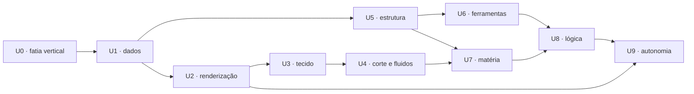

# Horizontes não agendados · Unrail Motor

**Estado documental:** inventário subordinado, revisado em 21 de agosto de 2026
**Estado de implementação:** nenhum crate existe. Zero linhas escritas.
**Relação com o [ROADMAP canônico](../ROADMAP.md):** este arquivo **não governa execução**. É um inventário de horizontes e hipóteses; somente cortes promovidos ao roadmap canônico podem ser iniciados.
**Pré-requisitos de leitura:** [léxico](../../specifications/prometheus/GLOSSARY.md) · [arquitetura](../../specifications/prometheus/ARCHITECTURE.md) · [catálogo](../../specifications/prometheus/CAPABILITY_CATALOG.md)

## 1 · A ambição, dita sem eufemismo

Construir incrementalmente, em Rust e com fronteiras próprias, um motor de
simulação em tempo real completo — fundação, assets, renderização, física,
mundo, roteiro e ferramentas — e usá-lo para produzir um simulador anatômico
realista com determinismo e proveniência de primeira classe.

Há **84 capacidades candidatas** no limite superior. Elas não equivalem a 84
crates aprovados. Este inventário existe para preservar hipóteses e permitir que
o roadmap canônico promova somente o menor corte com valor observável.

O que este programa não promete: paridade com MERIDIANO, prazo, ou que será
concluído.

## 2 · Princípios de programa

1. Cada corte entrega produto observável, não infraestrutura invisível.
2. Autoria própria exige valor comprovado; dependência auditada pode ser permanente.
3. A ciência continua em `brain-engine`; o motor apresenta e simula matéria, nunca biologia.
4. Determinismo é requisito de projeto, não otimização posterior.
5. Proveniência e orçamento entram junto com o efeito visual, no mesmo corte.
6. Um crate representa fronteira coesa; extração exige evidência.
7. Anel maior depende de menor e pode depender do mesmo anel sob DAG; o inverso é erro de build.
8. Nenhum backend próprio antes de existir produto rodando no emprestado.
9. WIP é 1: um corte aberto por vez, sempre.
10. Parar com dignidade é resultado aceitável; parar sem prova não é.

## 3 · Estado real

| Eixo | Valor verdadeiro |
| :-- | :-- |
| crates do motor existentes | 0 |
| capacidades candidatas | 84 |
| linhas de código do motor | 0 |
| workspace `engine/` | não criado |
| dependência externa adotada | nenhuma |
| impacto atual sobre o BRAIN PRO | nenhum; este é um movimento documental |

Qualquer afirmação futura de progresso exige auditoria com ambiente, comandos e
números, no mesmo formato de [`docs/audits/`](../../audits/0.10/AUDIT_0.10_R10_D.md).

## 4 · Marcos hipotéticos do componente

Não há semver prometido. IDs `U*` são somente rótulos de horizonte; cortes
promovidos recebem ID `UM*` no roadmap canônico e a versão do componente nasce
apenas com auditoria de release.

| Horizonte | Nome | Entrega central hipotética |
| :-- | :-- | :-- |
| U0 | fatia vertical | runner nativo provado antes de janela/GPU |
| U1 | dados confiáveis | assets, cache derivado, threads e build |
| U2 | renderização | grafo de quadro, materiais, luz, pós e sombras |
| U3 | tecido | umidade, difusão subsuperficial, volume e vascular |
| U4 | corte e fluidos | clipagem, camadas, reflexo e fluido ilustrativo |
| U5 | estrutura | reflexão, ECS, cena, mundo e serialização |
| U6 | ferramentas | editor, observatório, sequência e captura |
| U7 | matéria | física, tecido mole, fratura e háptico |
| U8 | autoria de lógica | roteiro, fluxo e procedimentos |
| U9 | autonomia | backends e subsistemas de escala aprovados por valor |

## 5 · Modelo obrigatório de corte

Herdado integralmente do [ROADMAP canônico](../ROADMAP.md): identidade,
problema e valor, pressupostos, fronteira, ciência, camadas, qualidade, prova e
risco. Acrescentam-se dois campos exclusivos deste programa:

| Campo extra | Obrigação |
| :-- | :-- |
| **autoria** | quais linhas são próprias, qual empréstimo é usado e qual `DEP-xxx` fica devendo |
| **valor isolado** | o que este crate continua valendo se o programa parar amanhã |

## 6 · U0 · fatia vertical (motor 0.1)

Detalhamento candidato em [PLAN_UNRAIL_UM0](../PLAN_UNRAIL_UM0.md); antes da promoção, o gate `UM0-ENTRY` elimina dependências cronologicamente impossíveis e reduz o conjunto inicial ao mínimo comprovável.

| Corte | Entrega | Aceite | Valor isolado |
| :-- | :-- | :-- | :-- |
| U0-A0 | runner headless direto sobre `brain-engine`, fixture nativa e trace normalizado | preset, entradas, passos e cinco hashes reproduzíveis no ambiente declarado | contrato nativo sem risco gráfico |
| U0-A1 | janela, dispositivo, superfície, profundidade reversa e laço | abre, redimensiona e fecha; lifetime `Window > Surface > Device` e contadores de recurso zerados | spike de plataforma e IHR reutilizável |
| U0-B | vértice canônico de 64 bytes, fixture geométrica, índices, limites e câmera orbital | hash de malha com serialização/versão declaradas em três execuções | biblioteca de malha e matemática independentes; import OBJ fica em U1-A |
| U0-C | especular por microfacetas, luz de área e primeiro material de tecido | tabela CPU, fonte, domínio e tolerância derivados da análise | shader e modelo de material reutilizáveis |
| U0-D | arena, alocador etiquetado, `Name` internado e `Pod` próprio | zero alocação por quadro após aquecimento; devolve `DEP-008` | fundação de memória própria |
| U0-E | interface provisória atrás de fachada, gizmos e sonda | todo controle com equivalente de teclado | fachada de UI e desenho de diagnóstico |
| U0-F | bancada: imagem de referência, envelope, orçamento e replay | gate roda no CI e falha por regressão real | harness de teste gráfico reutilizável |

## 7 · U1 · dados confiáveis (0.2)

| Corte | Entrega | Aceite |
| :-- | :-- | :-- |
| U1-A | serialização versionada e leitor de OBJ próprio | round-trip; arquivo malformado rejeitado; devolve `DEP-005` |
| U1-B | banco de assets, GUID, cache derivado e imagem | recarga a quente sem reiniciar; cache invalidado por versão de algoritmo |
| U1-C | grafo de tarefas determinístico e trace | `parallel-for` com ordem embaralhada produz resultado idêntico |
| U1-D | geometria (BVH, campo de distância, marching cubes), leitor de glTF próprio e `neuro_anatomy` | conformidade com o catálogo anatômico schema 1 já existente; devolve `DEP-004` |
| U1-E | orquestrador de build, cozimento e empacotamento | build reproduzível com manifesto de hashes |

## 8 · U2 · renderização de verdade (0.3)

| Corte | Entrega | Aceite |
| :-- | :-- | :-- |
| U2-A | grafo de quadro com recursos transitórios e barreiras | despejo textual do grafo por quadro; ciclo detectado em teste |
| U2-B | materiais, instâncias, luz de área, sondas de irradiância e IBL | conservação de energia verificada; teto de permutações declarado |
| U2-C | pós-processo, exposição, mapeamento tonal e gradação | curva reproduzível; comparação com o alvo tonal da pilha web |
| U2-D | configuração, variáveis de console e barramento de eventos | mudança de configuração não realoca recurso de GPU |
| U2-E | sombras em cascata com filtragem | orçamento medido; degradação declarada por perfil |

## 9 · U3 · tecido vivo (0.4)

| Corte | Entrega | Aceite |
| :-- | :-- | :-- |
| U3-A | segundo lobo especular e mapa de umidade derivado de curvatura assada | umidade acumula em sulcos por geometria, não por pintura manual |
| U3-B | difusão subsuperficial pré-integrada por curvatura e transmitância por espessura | comparação com referência offline; custo medido em passe próprio |
| U3-C | `neuro_vascular` com classes, ordens e anastomoses | espelha o contrato vascular existente; nenhuma animação de fluxo (VAS-001) |
| U3-D | renderização volumétrica direta e função de transferência | ingestão só de volume sintético; nenhum dado de paciente |

## 10 · U4 · corte, camadas e fluidos (0.5)

| Corte | Entrega | Aceite |
| :-- | :-- | :-- |
| U4-A | planos de clipagem, tampa por stencil e miolo com material próprio | corte não parece oco; custo com e sem clipagem medido separadamente |
| U4-B | transparência por camadas com transparência ponderada e descascamento de profundidade | descascar camadas sem artefato de ordenação; modo de captura usa o método caro |
| U4-C | reflexo de espaço de tela com profundidade hierárquica | fallback para sonda quando o raio falha; sem ruído temporal acima do envelope |
| U4-D | fluido de superfície: sangue e líquido sobre a face cortada | conservação de volume declarada; nenhuma afirmação hemodinâmica |
| U4-E | reconstrução temporal e efeitos por dados | ausência de fantasma acima do limiar; degradação declarada |

## 11 · U5 · estrutura (0.6)

| Corte | Entrega | Aceite |
| :-- | :-- | :-- |
| U5-A | Registro Vivo de Tipos e derivação por macro | serialização, editor e diff nascem do mesmo registro |
| U5-B | ECS com arquétipos e grafo de cena | agendamento determinístico provado com embaralhamento |
| U5-C | framework de aplicação, ticks, subsistemas e mapeamento de entrada | reconfiguração de entrada sem recompilar |
| U5-D | particionamento de mundo, streaming e origem em precisão dupla | sem estouro de precisão em escala de milímetro a metro |
| U5-E | pacote próprio, compressão e assinatura | devolve `DEP-006`; pacote verificado por hash antes do uso |

## 12 · U6 · ferramentas (0.7)

| Corte | Entrega | Aceite |
| :-- | :-- | :-- |
| U6-A | `um_ui` próprio, editor com docking, grade de propriedades e desfazer | devolve `DEP-007`; navegação completa por teclado |
| U6-B | Observatório de trace e agregação | sessão gravada abre e mostra o quadro que estourou o orçamento |
| U6-C | Trilha Temporal e captura determinística (`neuro_capture`) | mesma semente produz o mesmo vídeo, quadro a quadro |
| U6-D | contratos gerados, localização e artefatos de CI | tabela de IDs normativos gerada do código, não escrita à mão |

## 13 · U7 · matéria (0.8)

| Corte | Entrega | Aceite |
| :-- | :-- | :-- |
| U7-A | corpos rígidos, contatos, juntas e consultas | replay determinístico com semente; conservação declarada |
| U7-B | tecido mole XPBD tetraédrico com corte topológico e `neuro_surgical` | corte altera topologia sem explodir o solver; passo estável sob refino |
| U7-C | tecido fino e colisão com corpo | campos cirúrgicos e membranas sem interpenetração acima do limiar |
| U7-D | fratura e propagação de trinca | craniotomia com fragmentos reprodutíveis por semente |
| U7-E | esqueleto, skinning e cinemática inversa | instrumento segue a mão sem estalo |
| U7-F | laço háptico de alta frequência desacoplado do quadro | 1 kHz estável com queda de quadro simulada |

## 14 · U8 · autoria de lógica (0.9)

| Corte | Entrega | Aceite |
| :-- | :-- | :-- |
| U8-A | Linguagem de Roteiro, bytecode e VM com recarga | erro de tipo em tempo de compilação do roteiro, não em runtime |
| U8-B | Grafo de Fluxo compilando para o mesmo bytecode e editor de grafo | grafo e texto produzem bytecode idêntico para o mesmo programa |
| U8-C | Sistema de Procedimentos e Efeitos e máquinas de estado | protocolo cirúrgico descrito como dado versionado, com reversão |

## 15 · U9 · autonomia (1.0)

Este anel devolve os empréstimos. Ele é o **último** de propósito: substituir
infraestrutura antes de existir produto é o modo mais confiável de nunca ter
produto.

| Corte | Entrega | Aceite |
| :-- | :-- | :-- |
| U9-A | backend Vulkan próprio e plataforma Win32 própria | paridade de conformidade, imagem e custo antes da troca |
| U9-B | backend Direct3D 12 próprio | idem, com envelope por backend |
| U9-C | backend Metal próprio | idem |
| U9-D | backend WebGPU e alvo navegador | só então se discute o futuro da pilha web (UARC-008) |
| U9-E | linguagem e IR de sombreador próprias | devolve `DEP-003` |
| U9-F | plataformas X11 e macOS próprias | devolve `DEP-002` por completo |
| U9-G | Virtualização de Geometria | ganho medido em cena real, não em demonstração |
| U9-H | Iluminação Global por Cache de Superfície | comparação com referência assada |
| U9-I | Texturas Virtualizadas | só se existir atlas com proveniência aprovada |
| U9-J | Replicação Autoritativa | sessão instrutor/observador, sem dado pessoal |
| U9-K | Grafo de Áudio e processamento | espacialização verificada |
| U9-L | ABI própria e Módulos Externos | handshake de versão testado contra módulo incompatível |

## 16 · Dependências e paralelismo

Paralelismo permitido: nenhum. O WIP global do repositório é 1. Workspaces e CIs
separados isolam risco técnico, mas não criam uma segunda fila de execução.

## 17 · Esforço, não prazo

Datas seriam ficção. O que se pode declarar honestamente é **esforço relativo**,
tomando a fatia vertical como unidade.

| Fase | Esforço relativo | Confiança na estimativa |
| :-- | --: | :-- |
| U0 | 1,0 | média |
| U1 | 1,5 | média |
| U2 | 3,0 | baixa |
| U3 | 2,0 | baixa |
| U4 | 2,5 | baixa |
| U5 | 3,0 | baixa |
| U6 | 4,0 | muito baixa |
| U7 | 5,0 | muito baixa |
| U8 | 3,5 | muito baixa |
| U9 | 8,0 | especulativa |

Soma teórica: **33,5 unidades de fatia vertical**, com confiança rapidamente
decrescente. Não se converte esse valor em calendário: `UM0` precisa fornecer a
primeira velocidade observada antes de qualquer previsão.

## 18 · Riscos transversais

| ID | Risco | Prob./impacto | Indicador | Mitigação | Residual |
| :-- | :-- | :-- | :-- | :-- | :-- |
| URSK-01 | escopo incompatível com um mantenedor | alta/alta | fase aberta há mais de um ciclo sem corte fechado | WIP 1, valor isolado por crate, parada digna | alto |
| URSK-02 | empréstimo vira permanente | alta/média | prazo vencido na escada | auditoria por ciclo | médio |
| URSK-03 | `unsafe` se espalha | média/alta | locais/linhas subindo sem justificativa | inventário versionado, comentários `SAFETY`, Miri | baixo |
| URSK-04 | churn da camada emprestada | alta/média | build quebrado por atualização menor | versão fixada; atualização é corte | médio |
| URSK-05 | realismo lido como validação clínica | alta/alta | captura sem selo de proveniência | herda RSK-05 e AST-001; selo obrigatório | médio |
| URSK-06 | divergência entre pilha nativa e web | média/alta | hashes científicos diferentes | gate UQ-009 em todo corte | baixo |
| URSK-07 | ciência migrando para a GPU sem referência | baixa/alta | equação em shader | UM-011 e revisão de dependência | baixo |
| URSK-08 | CI ficando lento e sendo desligado | média/alta | tempo de gate acima do aceitável | workspaces separados; gate rápido e gate longo | médio |
| URSK-09 | asset anatômico sem licença ou com dado de paciente | média/alta | manifesto incompleto | herda RSK-07; dado de paciente é proibição absoluta | baixo |
| URSK-10 | determinismo perdido no paralelismo | média/alta | replay divergente | redução por ID, teste com ordem embaralhada | médio |
| URSK-11 | motor absorvendo domínio anatômico | média/média | vocabulário do produto dentro de `um_*` | gate UQ-007 | baixo |
| URSK-12 | nomenclatura ocultar origem/licença | média/alta | dependência ou referência sem identidade pública | SBOM, SPDX, referências e regras versionadas | baixo |

## 19 · Definição global de pronto

Uma fase só muda para **promovida** quando:

- toda fronteira criada no corte tem responsabilidade coesa e teste próprio;
- o orçamento da fase foi medido, publicado e comparado com o anterior;
- a bancada roda no CI e falha por regressão real;
- nenhum empréstimo novo entrou sem `DEP-xxx` e prazo;
- nenhum símbolo público cita crate externo;
- os cinco hashes científicos permanecem idênticos;
- a auditoria da fase registra ambiente, comandos e números reais;
- o campo **valor isolado** de cada crate foi preenchido honestamente.

## 20 · Critério de parada digna

O programa pode ser encerrado a qualquer momento sem que isso seja falha, desde
que o encerramento produza:

1. auditoria final com o que existe e o que não existe;
2. cada crate concluído publicado como biblioteca independente com README próprio;
3. `engine/` removido do build padrão, preservado em branch ou tag;
4. nenhuma alegação pendente em documento vigente.

Um programa que termina com dez bibliotecas Rust boas e uma janela nativa que
funciona vale mais do que um que termina com um motor incompleto e nenhuma prova.

## 21 · Integração adotada

O programa foi integrado às especificações, referências e planejamento do
repositório. O patch intermediário foi consumido e removido. Esta lista continua
sem autoridade de execução: o [roadmap canônico](../ROADMAP.md) é a única fila.
