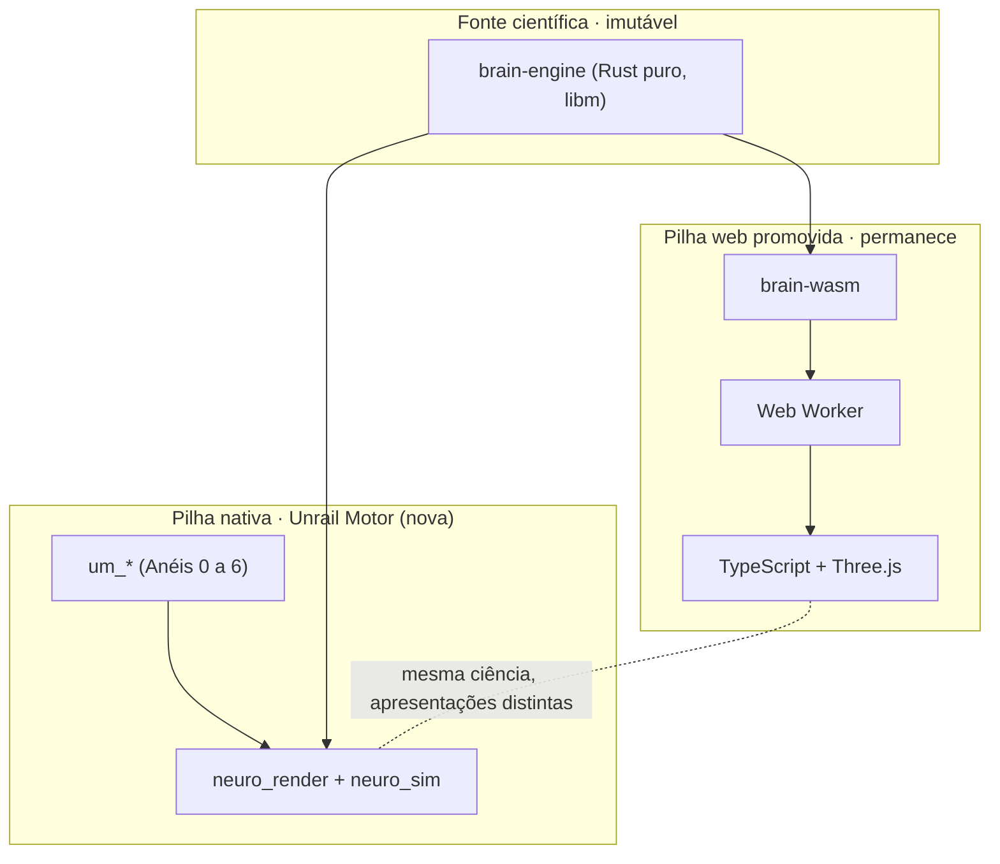
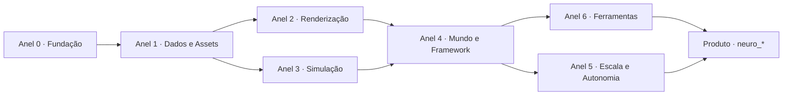

# Arquitetura do Unrail Motor

**Estado documental:** direção adotada com condicionantes, 21 de agosto de 2026
**Baseline de entrada:** repositório `blightghp`, produto `0.9.0`, ABI/protocolo/snapshot `8`, R10-D concluído
**Natureza:** documento de direção. Nada aqui está implementado. Toda linha marcada como estado atual descreve o BRAIN PRO, não o motor.
**Pré-requisito de leitura:** [léxico e transparência](GLOSSARY.md)

O Unrail Motor é a direção para um motor de simulação em tempo real escrito
predominantemente em Rust, com fronteiras próprias e dependências auditáveis. Ele nasce dentro
deste repositório como **segunda pilha de execução**, ao lado da pilha web já
promovida, e tem como primeiro produto um simulador anatômico realista
(`neuro_sim`).

## 1 · Princípios normativos

| ID | Requisito |
| :-- | :-- |
| UM-001 | Autoria própria é o padrão quando houver valor comprovado. Toda dependência externa é empréstimo ou infraestrutura permanente com ID, licença, versão e revisão na [política de dependências](DEPENDENCY_POLICY.md); fachada própria é obrigatória quando tipos/comportamento cruzam API pública ou fronteira substituível. |
| UM-002 | Um crate representa uma fronteira coesa e verificável. Ele só é extraído quando isola `unsafe`, compilação/feature, ownership, risco ou reúso comprovado; a gramática do nome não decide arquitetura. |
| UM-003 | Um crate pode depender de anel menor e de crates do mesmo anel sob DAG; nunca depende de anel maior. Ciclos e violações falham por checker próprio que consome `cargo metadata`; Cargo sozinho não conhece anéis. |
| UM-004 | Todo laço de simulação do motor declara passo, RNG, ordem de redução, plataforma e envelope de determinismo. Paralelismo não pode alterar resultados dentro do domínio promovido. |
| UM-005 | Todo artefato derivado carrega fingerprint reproduzível e versão de algoritmo. Fingerprint de regressão, como FNV-1a, nunca substitui digest ou assinatura de segurança. |
| UM-006 | O motor **nunca** possui ciência neurobiológica do BRAIN PRO. Equação, unidade, estado neural e hash biológico continuam exclusivos de `brain-engine`, conforme [ARC-001](../ARCHITECTURE.md). Física genérica de matéria pode pertencer a `um_*`, com contrato/determinismo próprios e sem alegação biológica. |
| UM-007 | `unsafe` é orçamento, não estilo. Só existe nas fronteiras listadas em §7, com comentário `SAFETY`, teste sob Miri quando aplicável e inventário de locais/linhas; contar blocos isoladamente não basta. |
| UM-008 | Nenhum crate do motor conhece o produto. `um_*` não sabe o que é um córtex; `neuro_*` não sabe o que é um descritor de pipeline. |
| UM-009 | Toda API pública do motor é `#[non_exhaustive]` onde a evolução é esperada, e versionada por hash de contrato quando cruza processo. |
| UM-010 | Nenhum objeto renderizável existe sem classe de proveniência declarada (`STATE`, `TOPOLOGY`, `DECORATION`), herdando [GFX-002](../GRAPHICS_SPEC.md). |
| UM-011 | Toda GPU é tratada como não confiável para valor científico: resultado de shader nunca retorna para o estado da simulação sem referência em CPU e teste de paridade. |
| UM-012 | O motor é local-first e offline-capable. Rede, telemetria e serviço remoto são opcionais e entram por requisito aprovado, conforme [ARC-007](../ARCHITECTURE.md). |
| UM-013 | Toda superfície pública nova entra com teste, orçamento e rollback no mesmo corte. Corte sem prova não é promovido. |
| UM-014 | Acessibilidade é requisito do motor, não do produto: teclado, foco, contraste, movimento reduzido e equivalente textual são serviços de `um_ui`. |
| UM-020 | Todo pass, shader e asset entra com teto medido de draws, triângulos, bytes e milissegundos, no modelo já usado em [PERF-011](../GRAPHICS_SPEC.md). |

## 2 · Relação com o BRAIN PRO

O programa não substitui nada que já está promovido. Ele acrescenta um alvo.



| Fronteira | Regra |
| :-- | :-- |
| `brain-engine` | permanece intocado. O motor **consome** o crate; não o modifica, não o encapsula, não o reimplementa. |
| pilha web | continua sendo a baseline pública ([ARC-005](../ARCHITECTURE.md)). O Unrail Motor não é justificativa para depreciá-la. |
| cinco hashes científicos | invariantes. Nenhum corte do motor pode alterá-los; o gate de invariância existente vale para os dois alvos. |
| ABI v8/Worker | intocada. A pilha nativa **não** usa a ABI Wasm: ela linka `brain-engine` diretamente e só fecha a lacuna do runner nativo quando uma fixture completa provar configuração, entradas e cinco hashes conforme o [ENGINE_SPEC](../ENGINE_SPEC.md). |
| catálogo anatômico e topologia vascular | migram por **espelhos versionados**, não por reescrita: catálogo pertence a `neuro_anatomy`; topologia vascular pertence a `neuro_vascular`. |
| proveniência, orçamento e acessibilidade | herdados como requisitos do motor, não reinventados. |

**Ganho verificável ao final de UM0:** um runner que linka `brain-engine`
nativamente pode fechar a contradição C-09 registrada em
[ARCHITECTURE](../ARCHITECTURE.md) — “Tauri roda núcleo nativo × host atual só
informa schema”. Criar um workspace ou uma janela não basta: o fechamento exige
`SimulationConfig`, entradas, preset e comparação dos cinco hashes.

## 3 · Anéis

O mapa-alvo é organizado em **sete anéis**, numerados de 0 a 6. A regra UM-003
é mecânica: o anel `N` depende apenas de anéis `< N` e de um DAG dentro do
próprio anel. As setas abaixo mostram ordem de habilitação, não direção de
dependência.



| Anel | Pergunta que responde | Crates típicos |
| :-- | :-- | :-- |
| 0 · Fundação | como representar, medir, alocar, paralelizar e falhar | `um_core`, `um_math`, `um_alloc`, `um_thread`, `um_platform`, `um_log` |
| 1 · Dados e Assets | como um byte em disco vira um objeto confiável | `um_serialize`, `um_asset`, `um_mesh`, `um_image`, `um_geometry` |
| 2 · Renderização | como transformar estado em pixel com orçamento | `um_rhi`, `um_shader`, `um_rg`, `um_render`, `um_material`, `um_post` |
| 3 · Simulação | como fazer matéria se mover de forma determinística | `um_physics`, `um_softbody`, `um_fluid`, `um_anim` |
| 4 · Mundo e Framework | como compor entidades, cenas e procedimentos | `um_ecs`, `um_scene`, `um_gameplay`, `um_ability`, `um_script` |
| 5 · Escala e Autonomia | como sair do empréstimo e crescer sem quebrar | `um_rhi_vk`, `um_geo_virt`, `um_gi`, `um_net`, `um_plugin` |
| 6 · Ferramentas | como autorar, medir e provar | `um_editor_core`, `um_insights`, `um_test`, `um_build` |

O catálogo completo é um mapa superior de capacidades. Seus nomes de crate e
fronteiras continuam provisórios até um corte comprovar a extração; não serão
criados diretórios vazios para materializá-lo. Consulte o
[catálogo de capacidades](CAPABILITY_CATALOG.md).

## 4 · Layout do repositório

O motor entra em **workspace separado**, para que os gates atuais não fiquem
mais lentos nem passem a depender de compilação gráfica.

```text
blightghp/
├── Cargo.toml              workspace científico/web (inalterado; ganha exclude = ["engine"])
├── crates/                 brain-engine, brain-wasm (inalterados)
├── src/, src-tauri/        pilha web e desktop (inalterados)
└── engine/                 NOVO workspace do Unrail Motor
    ├── Cargo.toml          [workspace] próprio, lints próprios, perfis próprios
    ├── crates/             foundation/, data/, render/, simulation/, framework/, autonomy/, tools/
    ├── products/neuro/
    │   ├── crates/         neuro_render, neuro_anatomy, neuro_vascular...
    │   └── apps/neuro_sim/ binário do simulador
    ├── fixtures/           contracts/, golden/, replays/, synthetic/
    └── xtask/              automação do workspace
```

Motivos da separação:

1. `cargo test --workspace` do repositório atual continua rodando em segundos e
   sem GPU;
2. o motor pode adotar `unsafe` controlado sem afrouxar
   `unsafe_code = "forbid"` do workspace científico (ver §7);
3. o motor pode fixar perfis, features e `resolver` próprios;
4. rollback do programa inteiro remove apenas o diretório explicitamente
   validado `engine/`, seu workflow e o `exclude` correspondente.

Custos aceitos: dois `Cargo.lock`, dois jobs de CI e duplicação de metadados de
workspace. Antes do primeiro build, `UM0-ENTRY` fixa uma release Rust exata para
o workspace novo; o canal móvel `stable` atual não sustenta promessa de ABI ou
reprodução binária.

## 5 · Fronteiras internas do motor

| Fronteira | Regra executável |
| :-- | :-- |
| motor × produto | `um_*` não contém nenhuma string de domínio anatômico. Um `grep` por termos do domínio nos crates do motor é gate de CI. |
| CPU × GPU | dados vão para a GPU por buffers explicitamente versionados. Nenhum valor da GPU volta para lógica sem caminho de referência em CPU (UM-011). |
| simulação × apresentação | a simulação avança em passo fixo; a apresentação interpola. Um quadro perdido nunca altera o número de passos executados. |
| render graph × renderer | `um_rg` não sabe o que é um material; `um_render` não aloca recurso transitório à mão. |
| janela × entrada | `um_platform` publica eventos brutos com carimbo de tempo; interpretação de gesto pertence a `um_ui`. |
| asset cru × asset cozido | o cru nunca é lido em runtime de produção; o cozido nunca é editado. Ambos referenciam a mesma identidade de conteúdo. Shaders ficam junto do crate proprietário. |

## 6 · Determinismo

O motor separa três domínios de determinismo, e nomeia cada um:

| Domínio | Garantia | Como se prova |
| :-- | :-- | :-- |
| **científico** | bit a bit somente no runtime, plataforma e fixture promovidos; paridade entre plataformas é afirmada apenas onde existe matriz explícita | replay + cinco hashes + ambiente registrado; hoje a prova cross-platform explícita é limitada por domínio |
| **de simulação do motor** (física, tecido, fluido) | meta bit a bit somente no target, flags, CPU features e fixture promovidos; fora deles, envelope/tolerância declarado | replay com semente, log de entradas, ambiente completo e hash de estado por passo |
| **de apresentação** | reprodutível por construção, não bit a bit no pixel | hash de geometria/atributo assado + comparação perceptual com envelope por backend, como já ocorre no gate gráfico atual |

Regras que sustentam o segundo domínio:

- reduções paralelas usam partição fixa e fusão por ID crescente, nunca ordem de
  conclusão de thread;
- `f32`/`f64` seguem política declarada por subsistema; nenhuma operação usa
  `fast-math` implícito;
- target triple, `target-cpu`, SIMD, FMA, denormals e flags do compilador fazem
  parte do envelope; mudança em qualquer um reabre a matriz;
- toda função transcendental crítica passa por `um_math`, que fixa a
  implementação (o mesmo motivo pelo qual `brain-engine` depende de `libm`);
- tempo de parede nunca entra em equação: entra apenas em quantos passos pedir.

## 7 · Orçamento de `unsafe`

O workspace científico mantém `unsafe_code = "forbid"`. O workspace do motor
também começa proibindo `unsafe` por padrão; somente pacotes allowlisted podem
relaxar o lint para FFI, sistema operacional ou layout de bytes. Backend
emprestado não justifica `unsafe` no código próprio.

| Crate | `unsafe` permitido | Justificativa | Contenção |
| :-- | :-- | :-- | :-- |
| `um_bytes` | sim | reinterpretar estruturas POD como bytes para a GPU | trait `Pod` derivada com verificação de layout; testes de tamanho/alinhamento por tipo |
| `um_alloc` | sim | implementar `GlobalAlloc` e arenas | invariantes documentadas, testes sob Miri |
| `um_platform_*` | sim | chamadas de sistema por plataforma | uma função `unsafe` por chamada, todas encapsuladas em API segura |
| `um_rhi_vk`, `um_rhi_dx12`, `um_rhi_mtl` | sim | APIs gráficas nativas | camada de validação ligada em debug; nenhum `unsafe` fora do backend |
| `um_abi` | sim | vtables `extern "C"` para módulos externos | handshake de versão e teste de compatibilidade |
| **todos os demais** | **não** | — | `#![forbid(unsafe_code)]` no topo do crate, verificado por lint de workspace |

Gate `UQ-030`: locais, linhas, símbolos e justificativas `SAFETY` formam um
artefato versionado. Crescimento sem justificativa e teste proporcional falha o
build; um único bloco grande não reduz o risco declarado.

## 8 · Módulos externos e ABI

Rust não tem ABI estável. O motor trata isso com honestidade em vez de fingir:

| Modo | Como funciona | Quando usar |
| :-- | :-- | :-- |
| **estático** (padrão) | módulos são crates compilados junto ao binário | sempre, salvo exceção |
| **dinâmico controlado** | biblioteca dinâmica com toolchain/target/features fixos e fronteira `extern "C"`; `repr(C)`, tamanhos, alinhamento, ownership, allocator, panic boundary, símbolos e handshake são versionados | recarga a quente no editor, somente após gate específico |
| **processo separado** | módulo roda em outro processo, comunicação por canal serializado (`um_serialize`) | ferramenta de terceiros, código não confiável |

Não existe modo “plugin binário compatível para sempre”. Essa promessa não é
sustentável por um mantenedor e não será feita.

## 9 · Pipeline gráfico alvo

```mermaid
flowchart LR
    SCENE["cena · um_scene"] --> CULL["culling · frustum + HZB"]
    CULL --> PRE["depth prepass com clipagem"]
    PRE --> GB["geometria · matéria"]
    GB --> AO["oclusão de tela"]
    AO --> LIT["iluminação direta + área + IBL"]
    LIT --> SSS["difusão subsuperficial"]
    SSS --> TRANS["transparência ponderada · camadas"]
    TRANS --> REFL["reflexo de espaço de tela"]
    REFL --> VOL["volumétrico · névoa cirúrgica"]
    VOL --> COMP["composição"]
    COMP --> TONE["exposição + mapeamento tonal"]
    TONE --> UI["interface, sonda e rótulos"]
```



Cada caixa é um pass declarado em `um_rg`, com teto próprio e fallback. A ordem
acima é a meta do Anel 2 completo; o [plano UM0](../../planning/PLAN_UNRAIL_UM0.md)
entrega apenas `depth prepass → matéria → iluminação → composição → mapeamento
tonal`.

## 10 · Decisões arquiteturais do programa

| ID | Decisão | Estado | Reversão exige |
| :-- | :-- | :-- | :-- |
| UARC-001 | O motor vive em workspace separado (`engine/`), com lints e perfis próprios | direção aceita; bloqueada até UM0-ENTRY | evidência de que a duplicação custa mais que o isolamento |
| UARC-002 | `brain-engine` é dependência do produto nativo e nunca é modificado pelo motor | aceita | mudança deliberada da arquitetura científica |
| UARC-003 | Dependência externa selecionada entra no registro; fachada é obrigatória em API pública ou fronteira substituível, não para todo tooling interno | aceita | uma API padrão precisar atravessar a fronteira com justificativa explícita |
| UARC-004 | A IHR (`um_rhi`) busca uma fachada e backends substituíveis; o primeiro backend pode ser emprestado | hipótese de UM0-A1 | spike mostrar que a abstração perde segurança ou desempenho |
| UARC-005 | Reflexão pode usar macro procedural própria, sem objeto raiz universal ou coletor de lixo | hipótese de horizonte | protótipo do editor e modelo de ownership |
| UARC-006 | O grafo visual pode compilar para o bytecode do roteiro textual | hipótese de horizonte | protótipo de autoria e depuração |
| UARC-007 | `unsafe` é orçado por local/linha/símbolo e auditado por artefato versionado | aceita | nenhum gatilho previsto |
| UARC-008 | O alvo web permanece na pilha Three.js até existir alternativa com paridade e fallback provados | aceita, herda ARC-005 | paridade visual e de custo medida |
| UARC-009 | O simulador nunca afirma validade clínica; proveniência e limitações são requisito transversal | aceita | nenhum gatilho previsto |
| UARC-010 | Determinismo tem três domínios nomeados e provas limitadas ao ambiente declarado | aceita | matriz adicional ampliar honestamente o domínio |

## 11 · O que esta arquitetura não resolve

- **Tempo.** Um motor deste porte é trabalho de anos para um mantenedor. A
  mitigação está no roadmap: cada corte entrega valor observável e nenhuma
  capacidade vira crate antes de provar uma fronteira isolável.
- **Paridade.** Nada aqui promete alcançar MERIDIANO. A meta é um motor de
  simulação realista com determinismo e proveniência de primeira classe.
- **Assets.** O motor não cria conteúdo anatômico. A ingestão de malhas reais
  continua bloqueada pelo pipeline de proveniência descrito no plano 0.10.
- **Validação clínica.** Fora de escopo, permanentemente, conforme SIG-012.

Documentos irmãos: [catálogo de capacidades](CAPABILITY_CATALOG.md) ·
[política de dependências](DEPENDENCY_POLICY.md) ·
[plano UM0](../../planning/PLAN_UNRAIL_UM0.md) ·
[horizontes não agendados](../../planning/backlog/UNRAIL_HORIZONS.md).
